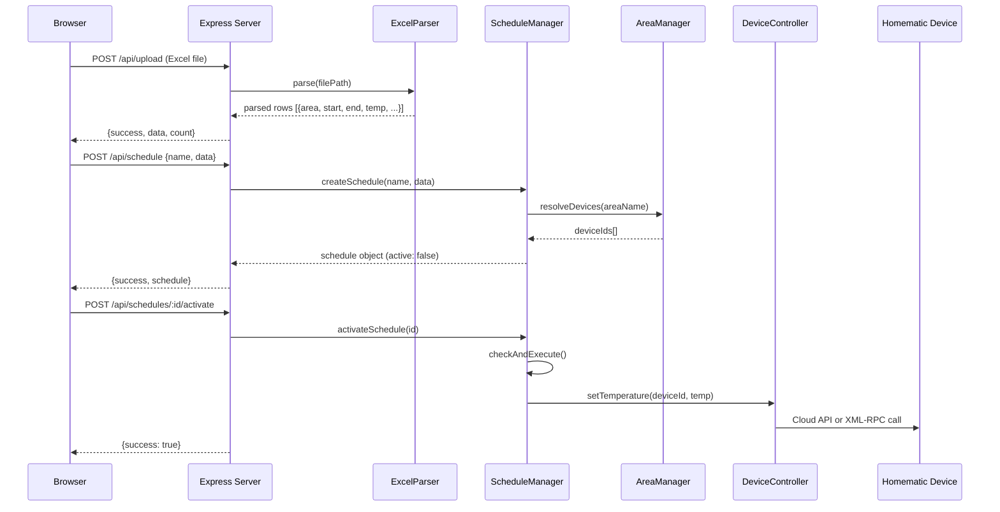
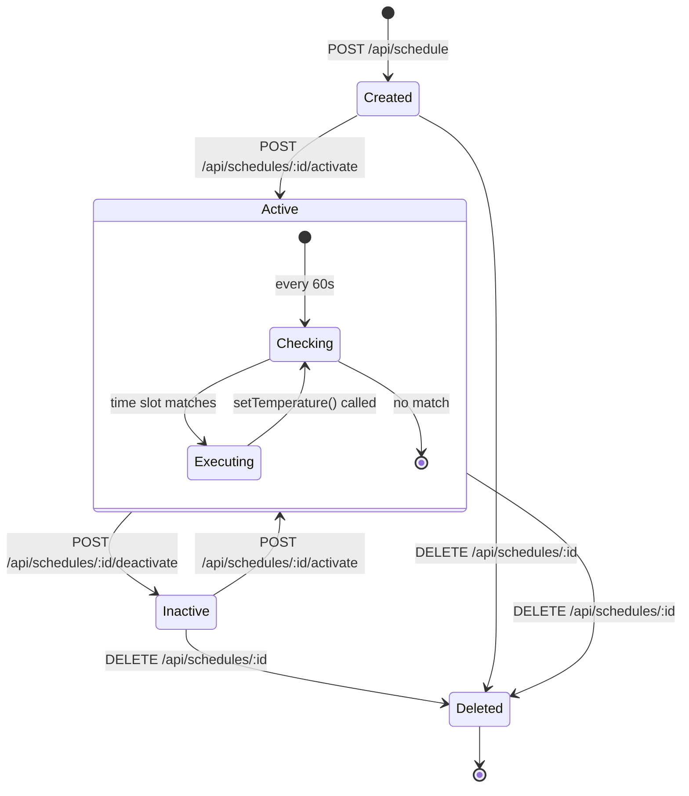

# REST API Reference

## General Information

| Property | Value |
|----------|-------|
| **Base URL** | `http://[host]:3000` |
| **Port** | 3000 (configurable via `PORT` env var) |
| **Content-Type** | `application/json` (except file upload) |
| **CORS** | Enabled for all origins |

All responses include a `success` field. Error responses use the format:

```json
{ "error": "Error message in German" }
```

## Endpoint Overview

| Method | Endpoint | Description |
|--------|----------|-------------|
| GET | `/` | Web interface |
| POST | `/api/upload` | Upload and parse Excel/Numbers file |
| POST | `/api/schedule` | Create schedule from parsed data |
| GET | `/api/schedules` | List all schedules |
| GET | `/api/schedules/:id` | Get specific schedule |
| POST | `/api/schedules/:id/activate` | Activate a schedule |
| POST | `/api/schedules/:id/deactivate` | Deactivate a schedule |
| DELETE | `/api/schedules/:id` | Delete a schedule |
| GET | `/api/areas` | List all areas |
| POST | `/api/areas` | Create/update an area |
| DELETE | `/api/areas/:name` | Delete an area |
| GET | `/api/profiles` | List heating profiles |
| GET | `/api/devices` | List all devices |

## Endpoints

### POST /api/upload

Upload and parse an Excel or Numbers file.

**Request:** `multipart/form-data`

| Field | Type | Required | Description |
|-------|------|----------|-------------|
| `file` | File | Yes | `.xlsx`, `.xls`, or `.numbers` file (max 10 MB) |

**Response (200):**
```json
{
  "success": true,
  "data": [
    {
      "area": "Wohnzimmer",
      "startDateTime": "2025-01-15T08:00:00.000Z",
      "endDateTime": "2025-01-15T22:00:00.000Z",
      "temperature": 21.0,
      "profile": "Komfort",
      "notes": null
    }
  ],
  "count": 1
}
```

**Errors:** 400 (no file, invalid format, parse error)

---

### POST /api/schedule

Create a new heating schedule from parsed data.

**Request Body:**
```json
{
  "name": "Winter-Heizplan",
  "data": [
    {
      "area": "Wohnzimmer",
      "startDateTime": "2025-01-15T08:00:00.000Z",
      "endDateTime": "2025-01-15T22:00:00.000Z",
      "temperature": 21.0,
      "profile": "Komfort",
      "notes": null
    }
  ]
}
```

**Response (200):**
```json
{
  "success": true,
  "schedule": {
    "id": "a1b2c3d4-e5f6-7890-abcd-ef1234567890",
    "name": "Winter-Heizplan",
    "areas": [
      {
        "areaName": "Wohnzimmer",
        "devices": ["DEV001", "DEV002"],
        "schedule": [
          {
            "startDateTime": "2025-01-15T08:00:00.000Z",
            "endDateTime": "2025-01-15T22:00:00.000Z",
            "temperature": 21.0,
            "profile": "Komfort",
            "notes": null
          }
        ]
      }
    ],
    "createdAt": "2025-01-10T12:00:00.000Z",
    "updatedAt": "2025-01-10T12:00:00.000Z",
    "active": false
  }
}
```

**Errors:** 400 (missing name/data), 503 (manager not initialized)

---

### GET /api/schedules

List all schedules.

**Response (200):**
```json
{
  "success": true,
  "schedules": [ /* array of schedule objects */ ]
}
```

---

### GET /api/schedules/:id

Get a specific schedule by UUID.

**Response (200):**
```json
{
  "success": true,
  "schedule": { /* schedule object */ }
}
```

**Errors:** 404 (not found), 503 (not initialized)

---

### POST /api/schedules/:id/activate

Activate a schedule. Triggers an immediate check-and-execute cycle.

**Response (200):**
```json
{ "success": true }
```

**Errors:** 404 (not found), 503 (not initialized)

---

### POST /api/schedules/:id/deactivate

Deactivate a schedule.

**Response (200):**
```json
{ "success": true }
```

**Errors:** 404 (not found), 503 (not initialized)

---

### DELETE /api/schedules/:id

Delete a schedule and its JSON file.

**Response (200):**
```json
{ "success": true }
```

**Errors:** 404 (not found), 503 (not initialized)

---

### GET /api/areas

List all defined areas.

**Response (200):**
```json
{
  "success": true,
  "areas": [
    {
      "name": "Wohnzimmer",
      "deviceIds": ["DEV001", "DEV002"],
      "createdAt": "2025-01-10T12:00:00.000Z",
      "updatedAt": "2025-01-10T12:00:00.000Z"
    }
  ]
}
```

---

### POST /api/areas

Create or update an area.

**Request Body:**
```json
{
  "name": "Wohnzimmer",
  "deviceIds": ["DEV001", "DEV002"]
}
```

**Response (200):**
```json
{
  "success": true,
  "area": {
    "name": "Wohnzimmer",
    "deviceIds": ["DEV001", "DEV002"],
    "createdAt": "2025-01-10T12:00:00.000Z",
    "updatedAt": "2025-01-10T12:00:00.000Z"
  }
}
```

**Errors:** 400 (missing name/deviceIds), 503 (not initialized)

---

### DELETE /api/areas/:name

Delete an area by name.

**Response (200):**
```json
{ "success": true }
```

**Errors:** 404 (not found), 503 (not initialized)

---

### GET /api/profiles

List all available heating profiles.

**Response (200):**
```json
{
  "success": true,
  "profiles": [
    { "name": "Komfort", "temperature": 21.0, "description": "Komfortable Raumtemperatur" },
    { "name": "Nacht", "temperature": 17.0, "description": "Nachtabsenkung" },
    { "name": "Abwesenheit", "temperature": 16.0, "description": "Temperatur bei Abwesenheit" },
    { "name": "Reduziert", "temperature": 19.0, "description": "Reduzierte Temperatur" }
  ]
}
```

---

### GET /api/devices

List all Homematic IP devices (requires addon initialization).

**Response (200):**
```json
{
  "success": true,
  "devices": [
    {
      "id": "3014F711A000XXXXXXXXXXXX",
      "name": "Thermostat Wohnzimmer",
      "type": "HEATING_THERMOSTAT",
      "model": "HmIP-eTRV-2",
      "manufacturer": "eQ-3",
      "firmware": "2.2.0",
      "lowBat": false,
      "unreach": false,
      "channels": []
    }
  ]
}
```

**Errors:** 503 (addon not initialized)

## Error Codes

| HTTP Status | Meaning |
|-------------|---------|
| 400 | Bad request -- missing parameters, invalid file, parse error |
| 404 | Resource not found -- schedule or area does not exist |
| 500 | Internal server error |
| 503 | Service unavailable -- addon, schedule manager, or area manager not initialized |

## API Interaction Workflow



## Schedule Lifecycle


