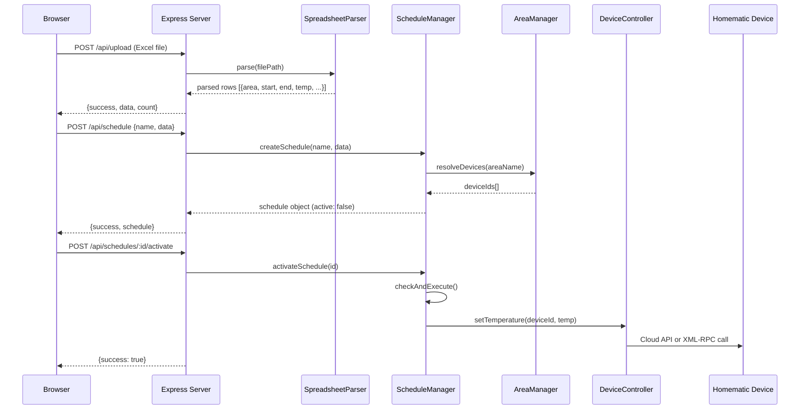
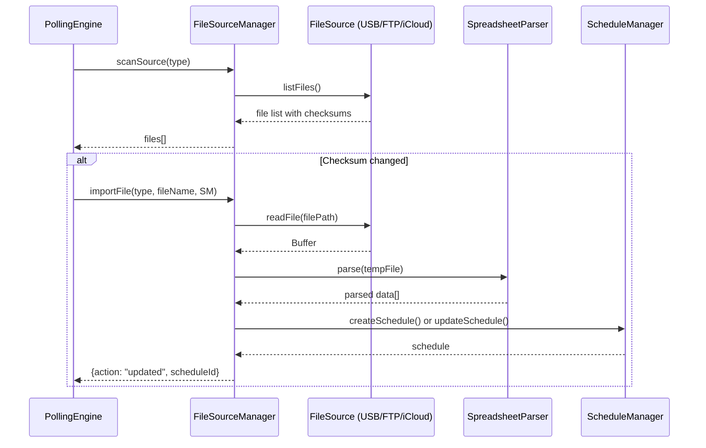
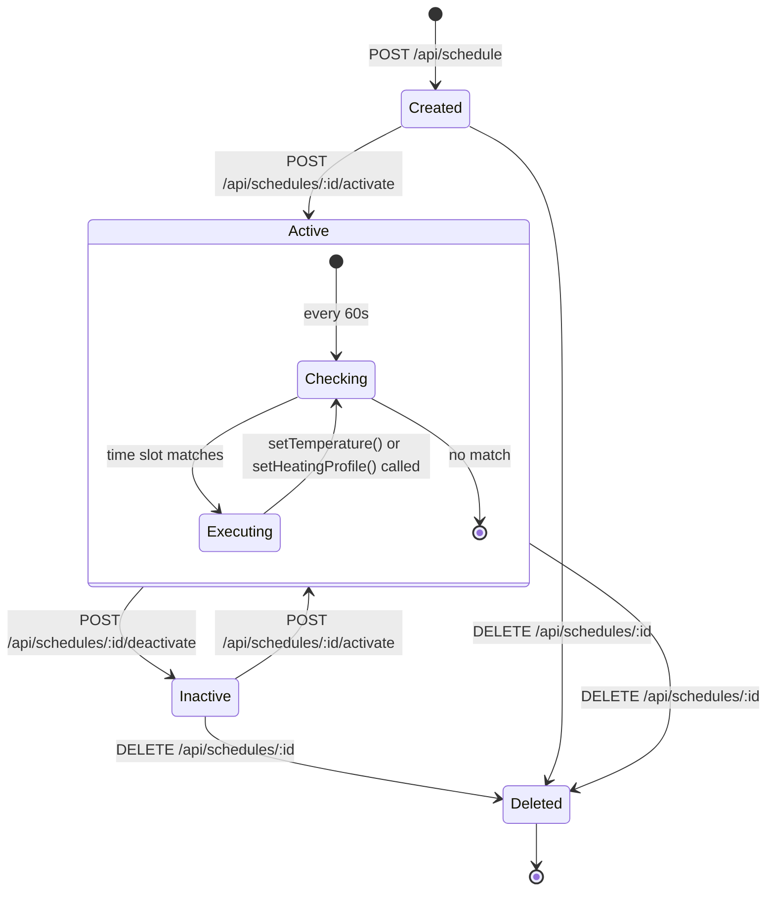

# REST API Reference

## General Information

| Property         | Value                                   |
| ---------------- | --------------------------------------- |
| **Base URL**     | `http://[host]:8080`                    |
| **Port**         | 8080 (configurable via `PORT` env var)  |
| **Content-Type** | `application/json` (except file upload) |
| **CORS**         | Enabled for all origins                 |

All responses include a `success` field. Error responses use the format:

```json
{ "error": "Error message in German" }
```

## Endpoint Overview

| Method | Endpoint                           | Description                         |
| ------ | ---------------------------------- | ----------------------------------- |
| GET    | `/`                                | Web interface                       |
| GET    | `/api/health`                      | Health check / system status        |
| POST   | `/api/upload`                      | Upload and parse Excel/Numbers file |
| POST   | `/api/schedule`                    | Create schedule from parsed data    |
| GET    | `/api/schedules`                   | List all schedules                  |
| GET    | `/api/schedules/:id`               | Get specific schedule               |
| POST   | `/api/schedules/:id/activate`      | Activate a schedule                 |
| POST   | `/api/schedules/:id/deactivate`    | Deactivate a schedule               |
| DELETE | `/api/schedules/:id`               | Delete a schedule                   |
| GET    | `/api/areas`                       | List all areas                      |
| POST   | `/api/areas`                       | Create/update an area               |
| DELETE | `/api/areas/:name`                 | Delete an area                      |
| GET    | `/api/profiles`                    | List heating profiles               |
| GET    | `/api/devices`                     | List all devices                    |
| GET    | `/api/devices/:id/heating-profile` | Get device heating profile          |
| POST   | `/api/devices/:id/heating-profile` | Set device heating profile          |
| GET    | `/api/sources`                     | List all file sources               |
| PUT    | `/api/sources/:type`               | Configure a file source             |
| POST   | `/api/sources/:type/test`          | Test file source connection         |
| POST   | `/api/sources/:type/scan`          | Scan source for files               |
| GET    | `/api/sources/:type/files`         | List cached scan results            |
| POST   | `/api/sources/:type/import`        | Import file from source             |
| POST   | `/api/sources/icloud/login`        | iCloud login                        |
| POST   | `/api/sources/icloud/verify-2fa`   | iCloud 2FA verification             |
| GET    | `/api/sources/icloud/auth-state`   | iCloud authentication state         |
| POST   | `/api/sources/icloud/logout`       | iCloud logout                       |
| POST   | `/api/push/upload`                 | Push file upload (API key required) |
| GET    | `/api/push/config`                 | Get push endpoint configuration     |
| PUT    | `/api/push/config`                 | Enable/disable push endpoint        |
| POST   | `/api/push/regenerate-key`         | Regenerate push API key             |
| GET    | `/api/polling/status`              | Get polling engine status           |
| POST   | `/api/polling/trigger`             | Trigger manual poll                 |
| PUT    | `/api/polling/config`              | Update polling configuration        |
| GET    | `/api/polling/log`                 | Get polling log entries             |

## Endpoints

### GET /api/health

Health check endpoint. Returns system status information.

**Response (200 / 503):**

```json
{
  "status": "ok",
  "uptime": 3600,
  "timestamp": "2025-01-15T12:00:00.000Z",
  "mode": "local",
  "ccuVerbunden": true,
  "aktiveZeitplaene": 2
}
```

Returns 503 when the CCU is not reachable. Includes `ccuFehler` field with error message on failure.

---

### POST /api/upload

Upload and parse an Excel or Numbers file.

**Request:** `multipart/form-data`

| Field  | Type | Required | Description                                     |
| ------ | ---- | -------- | ----------------------------------------------- |
| `file` | File | Yes      | `.xlsx`, `.xls`, or `.numbers` file (max 10 MB) |

**Response (200):**

```json
{
  "success": true,
  "data": [
    {
      "area": "Wohnzimmer",
      "startDateTime": "2025-01-15T08:00:00.000Z",
      "endDateTime": "2025-01-15T22:00:00.000Z",
      "temperature": 21.0,
      "profile": "Komfort",
      "deviceProfile": null,
      "controlMode": "temperature",
      "notes": null
    }
  ],
  "count": 1
}
```

**Errors:** 400 (no file, invalid format, parse error)

---

### POST /api/schedule

Create a new heating schedule from parsed data.

**Request Body:**

```json
{
  "name": "Winter-Heizplan",
  "data": [
    {
      "area": "Wohnzimmer",
      "startDateTime": "2025-01-15T08:00:00.000Z",
      "endDateTime": "2025-01-15T22:00:00.000Z",
      "temperature": 21.0,
      "profile": "Komfort",
      "notes": null
    }
  ]
}
```

**Response (200):**

```json
{
  "success": true,
  "schedule": {
    "id": "a1b2c3d4-e5f6-7890-abcd-ef1234567890",
    "name": "Winter-Heizplan",
    "areas": [
      {
        "areaName": "Wohnzimmer",
        "devices": ["DEV001", "DEV002"],
        "schedule": [
          {
            "startDateTime": "2025-01-15T08:00:00.000Z",
            "endDateTime": "2025-01-15T22:00:00.000Z",
            "temperature": 21.0,
            "profile": "Komfort",
            "deviceProfile": null,
            "controlMode": "temperature",
            "notes": null
          }
        ]
      }
    ],
    "createdAt": "2025-01-10T12:00:00.000Z",
    "updatedAt": "2025-01-10T12:00:00.000Z",
    "active": false
  }
}
```

**Errors:** 400 (missing name/data), 503 (manager not initialized)

---

### GET /api/schedules

List all schedules.

**Response (200):**

```json
{
  "success": true,
  "schedules": [
    /* array of schedule objects */
  ]
}
```

---

### GET /api/schedules/:id

Get a specific schedule by UUID.

**Response (200):**

```json
{
  "success": true,
  "schedule": {
    /* schedule object */
  }
}
```

**Errors:** 404 (not found), 503 (not initialized)

---

### POST /api/schedules/:id/activate

Activate a schedule. Triggers an immediate check-and-execute cycle.

**Response (200):**

```json
{ "success": true }
```

**Errors:** 404 (not found), 503 (not initialized)

---

### POST /api/schedules/:id/deactivate

Deactivate a schedule.

**Response (200):**

```json
{ "success": true }
```

**Errors:** 404 (not found), 503 (not initialized)

---

### DELETE /api/schedules/:id

Delete a schedule and its JSON file.

**Response (200):**

```json
{ "success": true }
```

**Errors:** 404 (not found), 503 (not initialized)

---

### GET /api/areas

List all defined areas.

**Response (200):**

```json
{
  "success": true,
  "areas": [
    {
      "name": "Wohnzimmer",
      "deviceIds": ["DEV001", "DEV002"],
      "createdAt": "2025-01-10T12:00:00.000Z",
      "updatedAt": "2025-01-10T12:00:00.000Z"
    }
  ]
}
```

---

### POST /api/areas

Create or update an area.

**Request Body:**

```json
{
  "name": "Wohnzimmer",
  "deviceIds": ["DEV001", "DEV002"]
}
```

**Response (200):**

```json
{
  "success": true,
  "area": {
    "name": "Wohnzimmer",
    "deviceIds": ["DEV001", "DEV002"],
    "createdAt": "2025-01-10T12:00:00.000Z",
    "updatedAt": "2025-01-10T12:00:00.000Z"
  }
}
```

**Errors:** 400 (missing name/deviceIds), 503 (not initialized)

---

### DELETE /api/areas/:name

Delete an area by name.

**Response (200):**

```json
{ "success": true }
```

**Errors:** 404 (not found), 503 (not initialized)

---

### GET /api/profiles

List all available heating profiles.

**Response (200):**

```json
{
  "success": true,
  "profiles": [
    {
      "name": "Komfort",
      "temperature": 21.0,
      "description": "Komfortable Raumtemperatur"
    },
    { "name": "Nacht", "temperature": 17.0, "description": "Nachtabsenkung" },
    {
      "name": "Abwesenheit",
      "temperature": 16.0,
      "description": "Temperatur bei Abwesenheit"
    },
    {
      "name": "Reduziert",
      "temperature": 19.0,
      "description": "Reduzierte Temperatur"
    }
  ]
}
```

---

### GET /api/devices

List all Homematic IP devices (requires addon initialization).

**Response (200):**

```json
{
  "success": true,
  "devices": [
    {
      "id": "3014F711A000XXXXXXXXXXXX",
      "name": "Thermostat Wohnzimmer",
      "type": "HEATING_THERMOSTAT",
      "model": "HmIP-eTRV-2",
      "manufacturer": "eQ-3",
      "firmware": "2.2.0",
      "lowBat": false,
      "unreach": false,
      "channels": []
    }
  ]
}
```

**Errors:** 503 (addon not initialized)

---

### GET /api/devices/:id/heating-profile

Get the current heating profile of a device.

**Response (200):**

```json
{
  "success": true,
  "data": {
    "activeProfile": 1,
    "mode": 0,
    "modeLabel": "Auto"
  }
}
```

Mode labels: `0 = Auto`, `1 = Manuell`, `2 = Party`

**Errors:** 503 (addon not initialized)

---

### POST /api/devices/:id/heating-profile

Set the heating profile of a device.

**Request Body:**

```json
{
  "profileNumber": 1
}
```

`profileNumber` must be 1, 2, or 3.

**Response (200):**

```json
{
  "success": true,
  "message": "Geraeteprofil 1 aktiviert auf Geraet DEV001."
}
```

**Errors:** 400 (invalid profileNumber), 503 (addon not initialized)

---

### GET /api/sources

List all file sources with their configuration and availability.

**Response (200):**

```json
{
  "success": true,
  "data": [
    {
      "type": "usb",
      "enabled": true,
      "available": true,
      "config": { "mountPoint": "/media/usb0", "subFolder": "" }
    },
    {
      "type": "fritzbox",
      "enabled": false,
      "available": false,
      "config": {
        "host": "",
        "port": 21,
        "username": "",
        "password": "********",
        "path": "/",
        "secure": true
      }
    },
    {
      "type": "icloud",
      "enabled": false,
      "available": false,
      "authState": "not_configured",
      "config": { "appleId": "", "path": "/Heizplan" }
    }
  ]
}
```

Passwords are masked in the response.

---

### PUT /api/sources/:type

Configure a file source. Type: `usb`, `fritzbox`, or `icloud`.

**Request Body (USB):**

```json
{
  "enabled": true,
  "mountPoint": "/media/usb0",
  "subFolder": "heizplaene"
}
```

**Request Body (FRITZ!Box):**

```json
{
  "enabled": true,
  "host": "fritz.box",
  "port": 21,
  "username": "ftpuser",
  "password": "secret",
  "path": "/FRITZ/NAS/Heizplan",
  "secure": true
}
```

**Response (200):**

```json
{
  "success": true,
  "message": "USB-Dateiquelle aktualisiert."
}
```

**Errors:** 400 (validation: missing required fields when enabled), 404 (unknown type)

---

### POST /api/sources/:type/test

Test connection to a file source.

**Response (200):**

```json
{ "success": true, "message": "Verbindung erfolgreich." }
```

or

```json
{ "success": false, "error": "Verbindung fehlgeschlagen: ECONNREFUSED" }
```

---

### POST /api/sources/:type/scan

Scan a file source for spreadsheet files.

**Response (200):**

```json
{
  "success": true,
  "data": [
    {
      "name": "heizplan-winter.xlsx",
      "path": "/media/usb0/heizplan-winter.xlsx",
      "size": 15360,
      "modified": "2025-01-10T08:00:00.000Z"
    }
  ]
}
```

---

### GET /api/sources/:type/files

Get cached scan results from the last scan.

**Response (200):**

```json
{
  "success": true,
  "data": [
    /* file objects */
  ]
}
```

---

### POST /api/sources/:type/import

Import a file from a source and create/update a schedule.

**Request Body:**

```json
{
  "fileName": "heizplan-winter.xlsx"
}
```

**Response (200):**

```json
{
  "success": true,
  "message": "Zeitplan 'heizplan-winter' erstellt.",
  "data": {
    "action": "created",
    "scheduleId": "uuid"
  }
}
```

`action` is `"created"` or `"updated"` (if a schedule from the same source already exists).

---

### POST /api/sources/icloud/login

Initiate iCloud login. May require 2FA.

**Request Body:**

```json
{
  "appleId": "user@icloud.com",
  "password": "secret"
}
```

**Response (200):**

```json
{
  "success": true,
  "data": {
    "status": "2fa_required"
  }
}
```

Possible status values: `authenticated`, `2fa_required`, `error`

---

### POST /api/sources/icloud/verify-2fa

Verify iCloud 2FA code.

**Request Body:**

```json
{
  "code": "123456"
}
```

**Response (200):**

```json
{
  "success": true,
  "data": {
    "status": "authenticated"
  }
}
```

---

### GET /api/sources/icloud/auth-state

Get current iCloud authentication state.

**Response (200):**

```json
{
  "success": true,
  "data": {
    "authState": "authenticated",
    "pythonAvailable": true,
    "appleId": "user@icloud.com"
  }
}
```

Possible `authState` values: `not_configured`, `python_missing`, `authenticated`, `2fa_required`, `reauth_required`, `login_required`

---

### POST /api/sources/icloud/logout

Logout from iCloud and delete session.

**Response (200):**

```json
{
  "success": true,
  "message": "iCloud-Session geloescht."
}
```

---

### POST /api/push/upload

Upload a spreadsheet file via push endpoint. Requires Bearer token authentication.

**Request:** `multipart/form-data` with `Authorization: Bearer <api-key>` header.

| Field  | Type | Required | Description                                     |
| ------ | ---- | -------- | ----------------------------------------------- |
| `file` | File | Yes      | `.xlsx`, `.xls`, or `.numbers` file (max 10 MB) |

**Response (200):**

```json
{
  "success": true,
  "message": "Zeitplan 'heizplan-winter' erstellt.",
  "data": {
    "action": "created",
    "scheduleId": "uuid"
  }
}
```

**Errors:** 401 (invalid API key), 403 (push disabled), 400 (no file/parse error)

---

### GET /api/push/config

Get push endpoint configuration.

**Response (200):**

```json
{
  "success": true,
  "data": {
    "enabled": true,
    "apiKey": "hex-string-64-chars",
    "endpoint": "/api/push/upload",
    "lastUpload": "2025-01-15T12:00:00.000Z",
    "lastUploadFile": "heizplan.xlsx"
  }
}
```

---

### PUT /api/push/config

Enable or disable push endpoint.

**Request Body:**

```json
{ "enabled": true }
```

**Response (200):**

```json
{
  "success": true,
  "message": "Push-Endpunkt aktiviert.",
  "data": { "enabled": true, "apiKey": "hex-string" }
}
```

---

### POST /api/push/regenerate-key

Regenerate the push API key. Invalidates the previous key.

**Response (200):**

```json
{
  "success": true,
  "message": "Neuer API-Key generiert.",
  "data": { "apiKey": "new-hex-string-64-chars" }
}
```

---

### GET /api/polling/status

Get polling engine status.

**Response (200):**

```json
{
  "success": true,
  "data": {
    "enabled": true,
    "intervalMinutes": 60,
    "running": true,
    "nextPoll": "2025-01-15T13:00:00.000Z",
    "sources": {
      "usb": {
        "lastChecked": "2025-01-15T12:00:00.000Z",
        "lastChanged": null,
        "consecutiveErrors": 0,
        "lastError": null
      }
    }
  }
}
```

---

### POST /api/polling/trigger

Manually trigger a poll cycle. Optionally specify a single source type.

**Request Body:**

```json
{ "type": "usb" }
```

Omit `type` or set to `null` to poll all enabled sources.

**Response (200):**

```json
{
  "success": true,
  "message": "Pruefung abgeschlossen.",
  "data": {
    /* poll results */
  }
}
```

---

### PUT /api/polling/config

Update polling configuration.

**Request Body:**

```json
{
  "enabled": true,
  "intervalMinutes": 30
}
```

Allowed intervals: 15, 30, 60, 120, 360 minutes.

**Response (200):**

```json
{
  "success": true,
  "message": "Polling-Konfiguration aktualisiert.",
  "data": { "enabled": true, "intervalMinutes": 30 }
}
```

---

### GET /api/polling/log

Get polling log entries.

**Query Parameters:**

| Parameter | Type   | Default | Description                  |
| --------- | ------ | ------- | ---------------------------- |
| `limit`   | number | 50      | Max number of entries (1-50) |

**Response (200):**

```json
{
  "success": true,
  "data": [
    {
      "timestamp": "2025-01-15T12:00:00.000Z",
      "type": "import",
      "source": "usb",
      "message": "Datei importiert: heizplan.xlsx"
    }
  ]
}
```

Log entry types: `error`, `import`, `change`, `disabled`, `source_missing`

## Error Codes

| HTTP Status | Meaning                                                                         |
| ----------- | ------------------------------------------------------------------------------- |
| 400         | Bad request -- missing parameters, invalid file, parse error                    |
| 401         | Unauthorized -- invalid API key (push endpoint)                                 |
| 403         | Forbidden -- push endpoint disabled                                             |
| 404         | Resource not found -- schedule, area, or source does not exist                  |
| 500         | Internal server error                                                           |
| 503         | Service unavailable -- addon, schedule manager, or area manager not initialized |

## API Interaction Workflow


```mermaid
sequenceDiagram
    participant User as Browser
    participant Server as Express Server
    participant Parser as SpreadsheetParser
    participant SM as ScheduleManager
    participant AM as AreaManager
    participant DC as DeviceController
    participant HW as Homematic Device

    User->>Server: POST /api/upload (Excel file)
    Server->>Parser: parse(filePath)
    Parser-->>Server: parsed rows [{area, start, end, temp, ...}]
    Server-->>User: {success, data, count}

    User->>Server: POST /api/schedule {name, data}
    Server->>SM: createSchedule(name, data)
    SM->>AM: resolveDevices(areaName)
    AM-->>SM: deviceIds[]
    SM-->>Server: schedule object (active: false)
    Server-->>User: {success, schedule}

    User->>Server: POST /api/schedules/:id/activate
    Server->>SM: activateSchedule(id)
    SM->>SM: checkAndExecute()
    SM->>DC: setTemperature(deviceId, temp)
    DC->>HW: Cloud API or XML-RPC call
    Server-->>User: {success: true}
```

## File Source Import Workflow


```mermaid
sequenceDiagram
    participant PE as PollingEngine
    participant FSM as FileSourceManager
    participant Src as FileSource (USB/FTP/iCloud)
    participant SP as SpreadsheetParser
    participant SM as ScheduleManager

    PE->>FSM: scanSource(type)
    FSM->>Src: listFiles()
    Src-->>FSM: file list with checksums
    FSM-->>PE: files[]

    alt Checksum changed
        PE->>FSM: importFile(type, fileName, SM)
        FSM->>Src: readFile(filePath)
        Src-->>FSM: Buffer
        FSM->>SP: parse(tempFile)
        SP-->>FSM: parsed data[]
        FSM->>SM: createSchedule() or updateSchedule()
        SM-->>FSM: schedule
        FSM-->>PE: {action: "updated", scheduleId}
    end
```

## Schedule Lifecycle


```mermaid
stateDiagram-v2
    [*] --> Created: POST /api/schedule
    Created --> Active: POST /api/schedules/:id/activate
    Active --> Inactive: POST /api/schedules/:id/deactivate
    Inactive --> Active: POST /api/schedules/:id/activate
    Active --> Deleted: DELETE /api/schedules/:id
    Inactive --> Deleted: DELETE /api/schedules/:id
    Created --> Deleted: DELETE /api/schedules/:id
    Deleted --> [*]

    state Active {
        [*] --> Checking: every 60s
        Checking --> Executing: time slot matches
        Executing --> Checking: setTemperature() or setHeatingProfile() called
        Checking --> [*]: no match
    }
```
