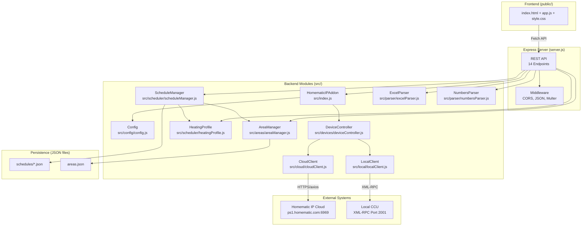
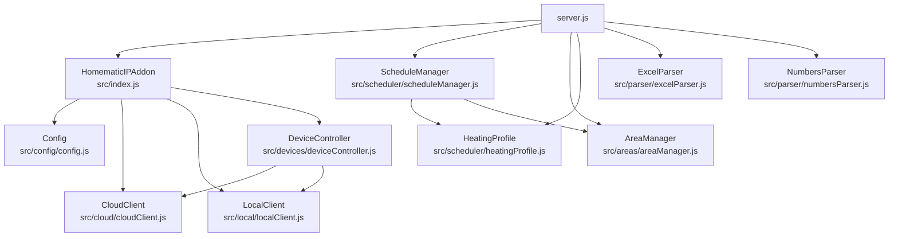
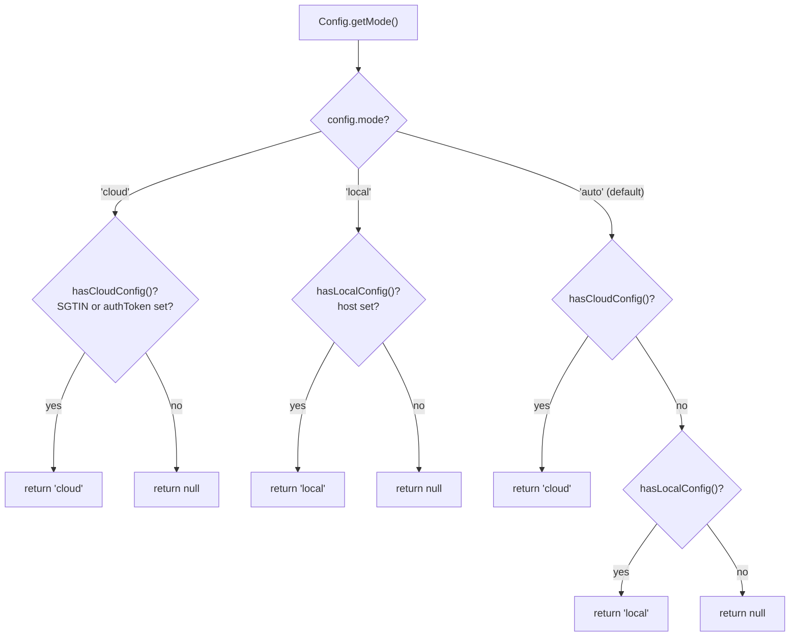
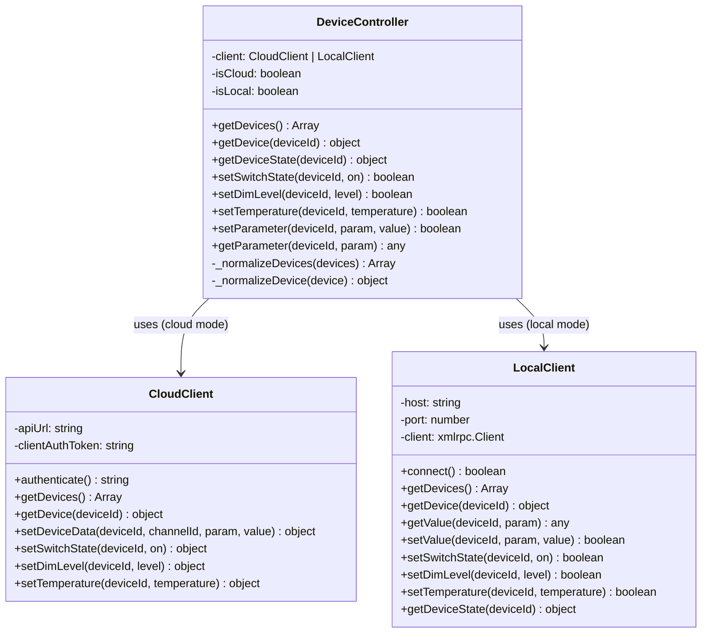

# System Architecture

## Overview

my-homematic-addon is a three-tier Node.js application that controls Homematic IP smart home devices through either the Homematic IP Cloud API or a local CCU (Central Control Unit) via XML-RPC. It provides a web interface for uploading Excel-based heating schedules and managing device areas.

## Component Architecture



## Module Dependency Graph



## Connection Mode Strategy

The addon supports three connection modes configured via `HOMEMATIC_MODE` environment variable or constructor parameter:



In auto mode, cloud is preferred over local when both configurations are available.

## Device Abstraction Layer

DeviceController provides a unified interface over both CloudClient and LocalClient. It detects the client type via `instanceof` and normalizes device data to a common format:



**Normalization mapping:**

| Normalized Field | Cloud Source                    | Local (CCU) Source              |
| ---------------- | ------------------------------- | ------------------------------- |
| `id`             | `device.id`                     | `device.ADDRESS` or `device.ID` |
| `name`           | `device.label` or `device.name` | `device.NAME`                   |
| `type`           | `device.type`                   | `device.TYPE`                   |
| `model`          | `device.modelType`              | `device.TYPE`                   |
| `firmware`       | `device.firmwareVersion`        | `device.FIRMWARE`               |
| `channels`       | `device.functionalChannels`     | `[]` (not available)            |

## Data Persistence

The addon uses a file-based persistence model with no database:

| Data              | Storage                 | Format                               |
| ----------------- | ----------------------- | ------------------------------------ |
| Heating schedules | `schedules/{uuid}.json` | One JSON file per schedule           |
| Area definitions  | `areas.json`            | Single JSON file, keyed by area name |
| Uploaded files    | `uploads/`              | Temporary -- deleted after parsing   |

## Directory Structure

```
my-homematic-addon/
├── src/
│   ├── index.js                    # HomematicIPAddon main class + exports
│   ├── config/
│   │   └── config.js               # Config management (cloud/local/auto)
│   ├── cloud/
│   │   └── cloudClient.js          # Homematic IP Cloud API client
│   ├── local/
│   │   └── localClient.js          # CCU XML-RPC client
│   ├── devices/
│   │   └── deviceController.js     # Unified device abstraction layer
│   ├── scheduler/
│   │   ├── scheduleManager.js      # Schedule CRUD + 60s execution loop
│   │   └── heatingProfile.js       # Predefined heating profiles
│   ├── areas/
│   │   └── areaManager.js          # Area/zone management
│   └── parser/
│       ├── excelParser.js          # Excel file parser (.xlsx/.xls)
│       └── numbersParser.js        # Apple Numbers file wrapper
├── public/
│   ├── index.html                  # Web UI (upload, areas, schedules)
│   ├── app.js                      # Frontend logic (drag-drop, API calls)
│   └── style.css                   # Responsive styling
├── server.js                       # Express server + REST API
├── examples/
│   └── basic-usage.js              # Cloud/local/auto usage examples
├── addon/
│   ├── install.sh                  # CCU installation script
│   ├── uninstall.sh                # CCU uninstallation script
│   ├── addon.conf                  # Addon metadata
│   ├── install.conf                # Installation config
│   └── package-addon.sh            # Build packaging script
├── docs/                           # Documentation
├── schedules/                      # Runtime: schedule JSON files
├── uploads/                        # Runtime: temporary uploaded files
├── build/                          # Build output (tar.gz)
└── package.json                    # Dependencies and scripts
```
