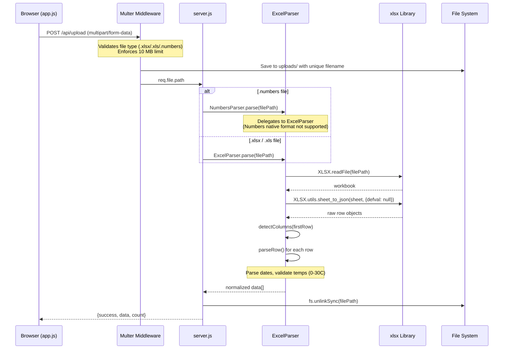
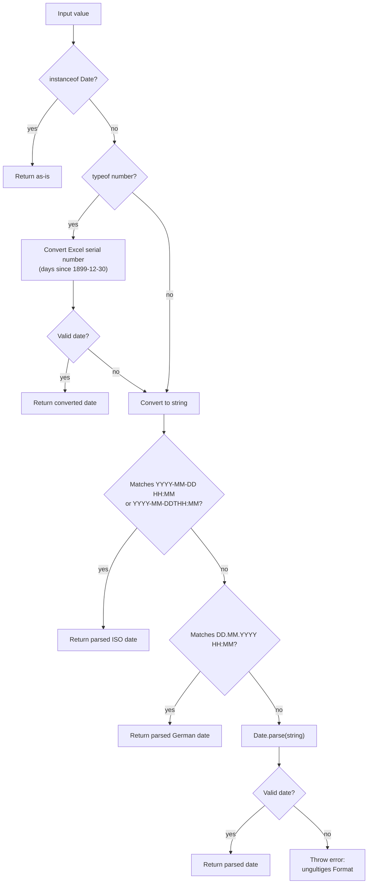
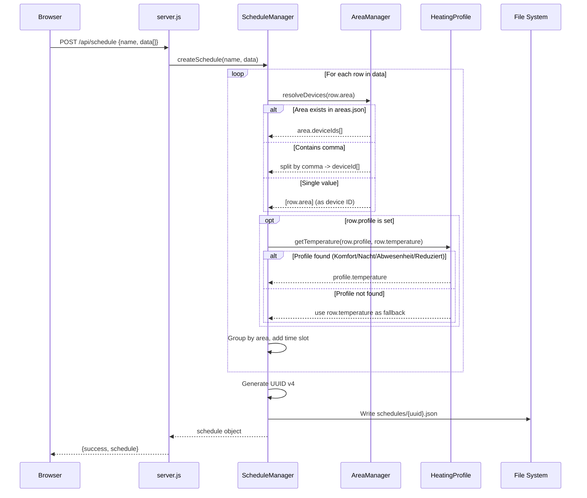
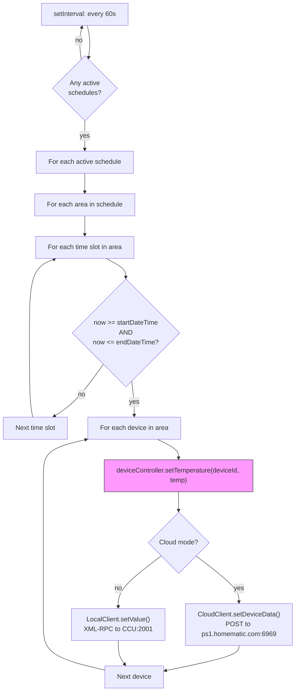
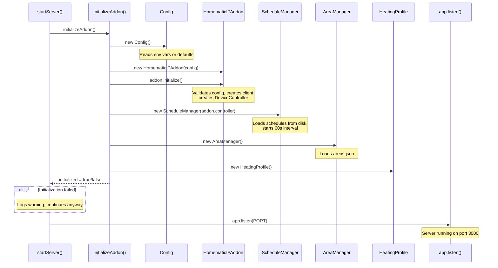

# Data Flow & Workflows

## 1. Excel/Numbers Upload Workflow

When a user uploads a spreadsheet, the following sequence occurs:



### Column Auto-Detection

The parser performs case-insensitive matching against the column headers in the first row of the spreadsheet. At minimum, **Bereich**, **Startdatum**, and **Enddatum** must be found.

| Internal Field | Accepted Column Names |
|---------------|----------------------|
| `area` | bereich, area, zone, raum |
| `startDateTime` | startdatum, start datetime, startzeit, start time, start, von, beginn |
| `endDateTime` | enddatum, end datetime, endzeit, end time, end, bis, ende |
| `temperature` | temperatur, temperature, temp, C, celsius |
| `profile` | heizprofil, profil, profile, heating profile |
| `notes` | zusatzinfo, notes, notiz, bemerkung, info, information |

### Date Parsing Logic

The parser attempts multiple formats in order of priority:



### Temperature Validation

- Must be a valid number
- Must be between 0 and 30 C
- Parsed via `parseFloat()`

---

## 2. Schedule Creation Workflow

After uploading and parsing, the user creates a schedule from the parsed data:



### Schedule Data Structure

```json
{
  "id": "uuid-v4",
  "name": "Schedule Name",
  "areas": [
    {
      "areaName": "Wohnzimmer",
      "devices": ["DEV001", "DEV002"],
      "schedule": [
        {
          "startDateTime": "2025-01-15T08:00:00.000Z",
          "endDateTime": "2025-01-15T22:00:00.000Z",
          "temperature": 21.0,
          "profile": "Komfort",
          "notes": null
        }
      ]
    }
  ],
  "createdAt": "ISO timestamp",
  "updatedAt": "ISO timestamp",
  "active": false
}
```

---

## 3. Schedule Execution Loop

Once activated, the ScheduleManager polls every 60 seconds:



Key behaviors:
- **Interval:** 60 seconds (`setInterval`)
- **Immediate check:** Runs once on activation (`activateSchedule()` calls `checkAndExecute()`)
- **Error handling:** Individual device errors are logged but do not stop execution of other devices
- **No deduplication:** Temperature is set every 60 seconds as long as the time slot is active

---

## 4. Area Resolution

When the ScheduleManager processes an area name from the parsed data, it uses `AreaManager.resolveDevices()`:

```
Input: "Wohnzimmer"
  -> Check areas.json: found? -> return ["DEV001", "DEV002"]
  -> Not found, contains comma? "DEV001,DEV002" -> return ["DEV001", "DEV002"]
  -> Not found, no comma -> return ["Wohnzimmer"] (treated as single device ID)
```

---

## 5. Predefined Heating Profiles

| Profile | Temperature | Description |
|---------|------------|-------------|
| Komfort | 21.0 C | Komfortable Raumtemperatur |
| Nacht | 17.0 C | Nachtabsenkung |
| Abwesenheit | 16.0 C | Temperatur bei Abwesenheit |
| Reduziert | 19.0 C | Reduzierte Temperatur |

Custom profiles can be created via `HeatingProfile.createProfile()` (temperature range: 0-30 C). Predefined profiles cannot be deleted.

---

## 6. Server Initialization Flow



The server starts even if the addon cannot connect to the Homematic system. API endpoints that require the addon return 503 in this case.
