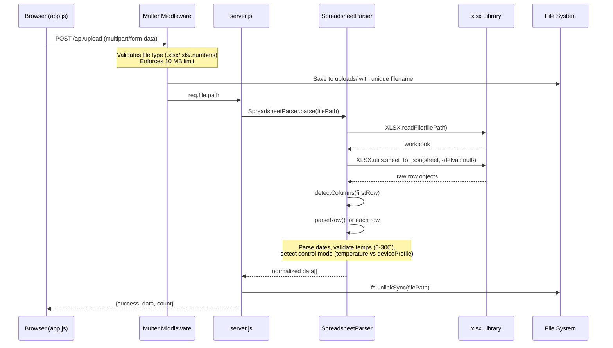
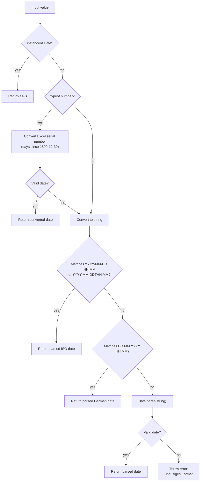
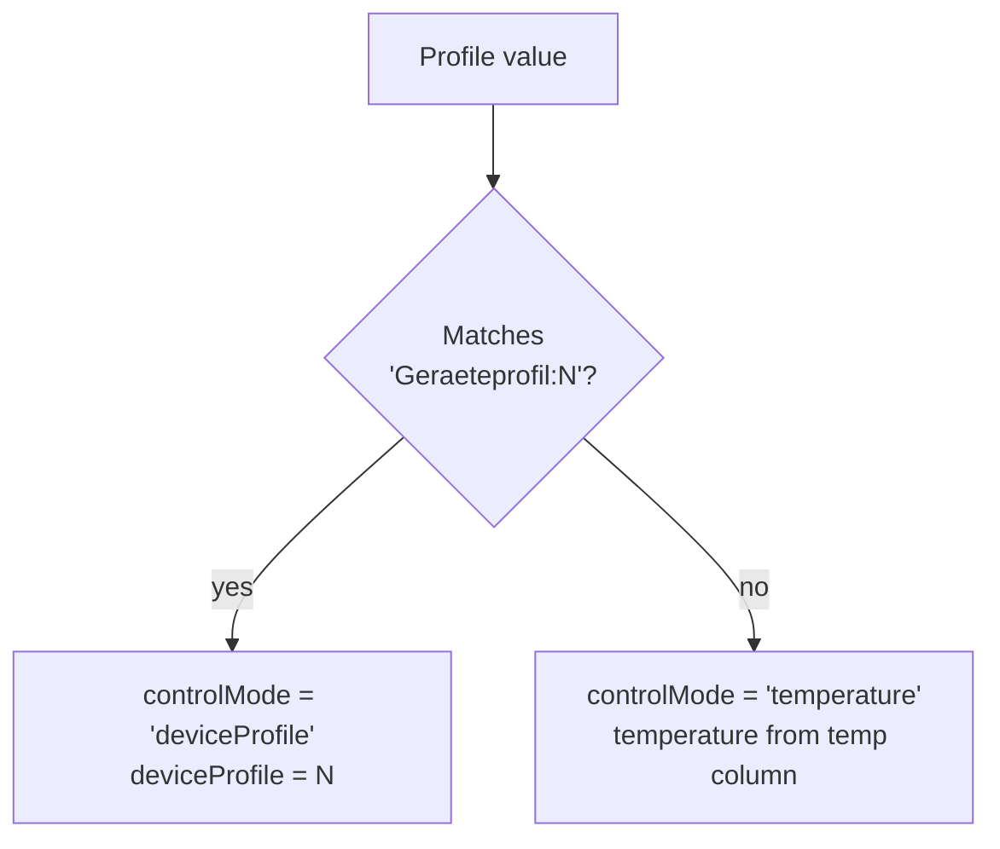
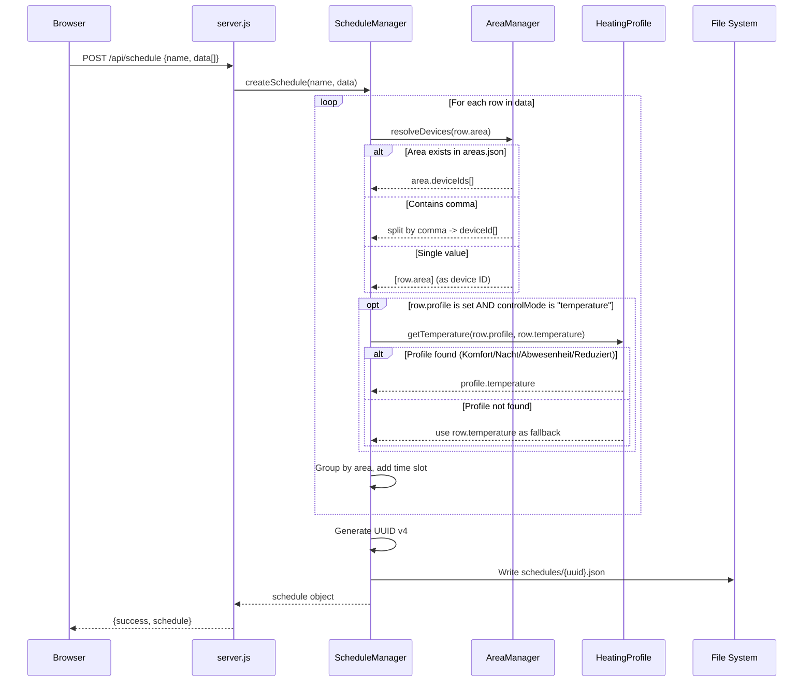
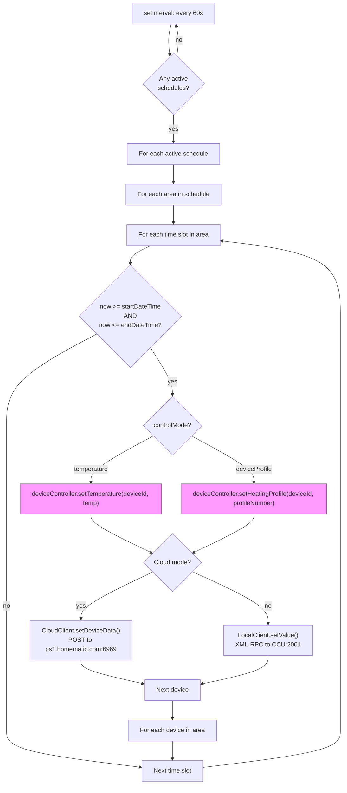
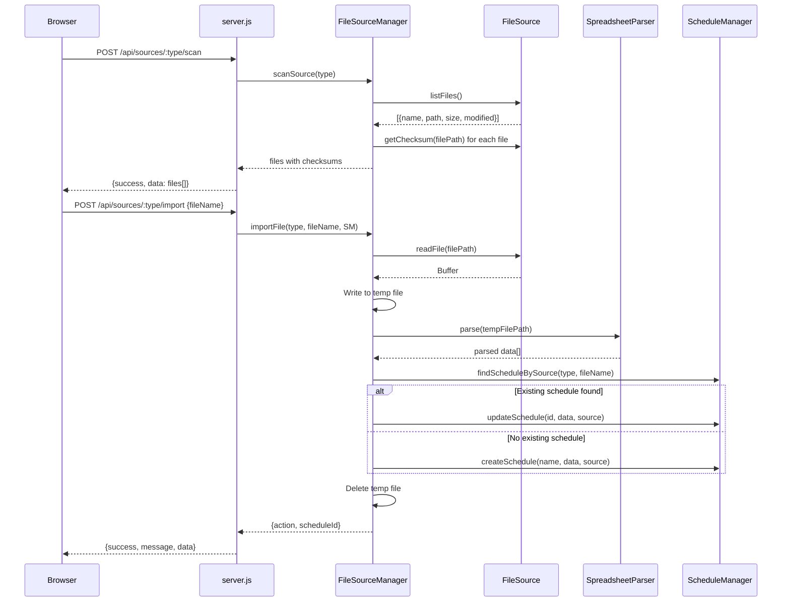
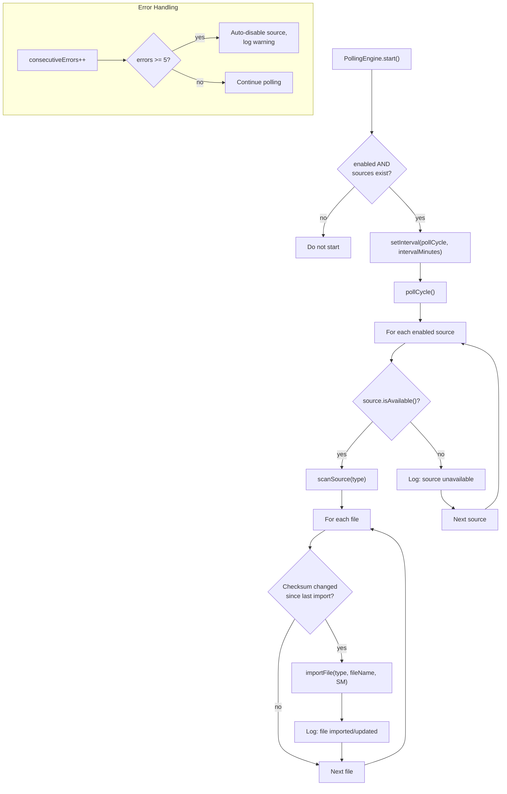
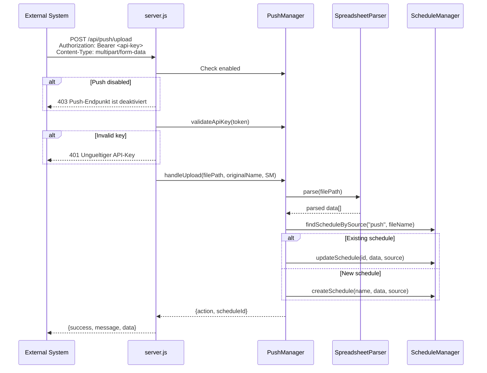
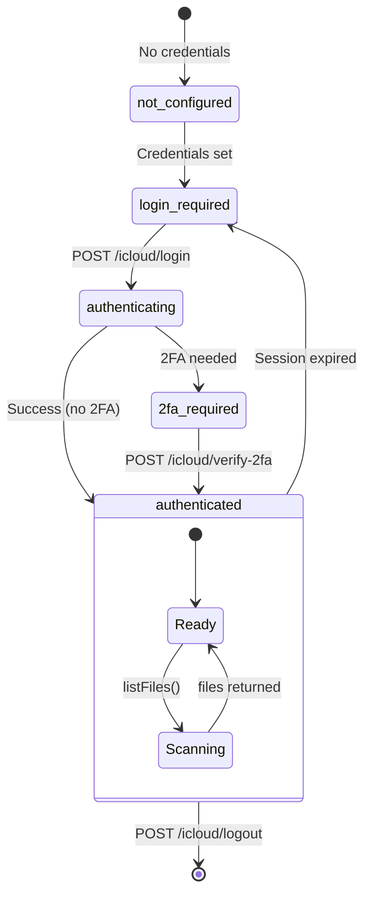
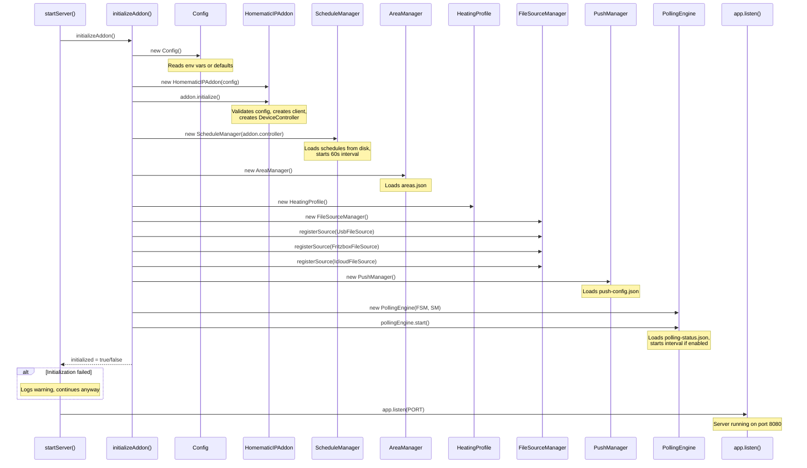

# Data Flow & Workflows

## 1. Spreadsheet Upload Workflow

When a user uploads a spreadsheet, the following sequence occurs:


```mermaid
sequenceDiagram
    participant User as Browser (app.js)
    participant Multer as Multer Middleware
    participant Server as server.js
    participant Parser as SpreadsheetParser
    participant XLSX as xlsx Library
    participant FS as File System

    User->>Multer: POST /api/upload (multipart/form-data)
    Note over Multer: Validates file type (.xlsx/.xls/.numbers)<br/>Enforces 10 MB limit
    Multer->>FS: Save to uploads/ with unique filename
    Multer->>Server: req.file.path

    Server->>Parser: SpreadsheetParser.parse(filePath)
    Parser->>XLSX: XLSX.readFile(filePath)
    XLSX-->>Parser: workbook
    Parser->>XLSX: XLSX.utils.sheet_to_json(sheet, {defval: null})
    XLSX-->>Parser: raw row objects

    Parser->>Parser: detectColumns(firstRow)
    Parser->>Parser: parseRow() for each row
    Note over Parser: Parse dates, validate temps (0-30C),<br/>detect control mode (temperature vs deviceProfile)

    Parser-->>Server: normalized data[]
    Server->>FS: fs.unlinkSync(filePath)
    Server-->>User: {success, data, count}
```

### Column Auto-Detection

The SpreadsheetParser performs case-insensitive matching against the column headers in the first row of the spreadsheet. At minimum, **Bereich**, **Startdatum**, and **Enddatum** must be found.

| Internal Field  | Accepted Column Names                                                 |
| --------------- | --------------------------------------------------------------------- |
| `area`          | Bereich, Area, Zone, Raum                                             |
| `startDateTime` | Startdatum, Start DateTime, Startzeit, Start Time, Start, Von, Beginn |
| `endDateTime`   | Enddatum, End DateTime, Endzeit, End Time, End, Bis, Ende             |
| `startDate`     | Startdatum (combined with separate time column)                       |
| `startTime`     | Startzeit (combined with separate date column)                        |
| `endDate`       | Enddatum (combined with separate time column)                         |
| `endTime`       | Endzeit (combined with separate time column)                          |
| `temperature`   | Temperatur, Temperature, Temp, C, Celsius                             |
| `profile`       | Heizprofil, Profil, Profile, Heating Profile                          |
| `notes`         | Zusatzinfo, Veranstaltung, Notes, Notiz, Bemerkung, Info, Information |

### Date Parsing Logic

The parser attempts multiple formats in order of priority:


```mermaid
flowchart TD
    Input["Input value"] --> IsDate{"instanceof Date?"}
    IsDate -- "yes" --> ReturnDate["Return as-is"]
    IsDate -- "no" --> IsNumber{"typeof number?"}

    IsNumber -- "yes" --> ExcelSerial["Convert Excel serial number<br/>(days since 1899-12-30)"]
    ExcelSerial --> ValidSerial{"Valid date?"}
    ValidSerial -- "yes" --> ReturnConverted["Return converted date"]
    ValidSerial -- "no" --> ToString["Convert to string"]

    IsNumber -- "no" --> ToString
    ToString --> ISOMatch{"Matches YYYY-MM-DD HH:MM<br/>or YYYY-MM-DDTHH:MM?"}
    ISOMatch -- "yes" --> ReturnISO["Return parsed ISO date"]
    ISOMatch -- "no" --> DEMatch{"Matches DD.MM.YYYY HH:MM?"}
    DEMatch -- "yes" --> ReturnDE["Return parsed German date"]
    DEMatch -- "no" --> Fallback["Date.parse(string)"]
    Fallback --> ValidFallback{"Valid date?"}
    ValidFallback -- "yes" --> ReturnFallback["Return parsed date"]
    ValidFallback -- "no" --> Error["Throw error:<br/>ungultiges Format"]
```

### Temperature & Control Mode Parsing

The parser detects two control modes:

- **temperature** (default): Direct temperature value (0-30 C)
- **deviceProfile**: When the profile column contains `"Geraeteprofil:N"` (N = 1, 2, or 3)


```mermaid
flowchart TD
    Profile["Profile value"] --> HasDevProfile{"Matches<br/>'Geraeteprofil:N'?"}
    HasDevProfile -- "yes" --> DevMode["controlMode = 'deviceProfile'<br/>deviceProfile = N"]
    HasDevProfile -- "no" --> TempMode["controlMode = 'temperature'<br/>temperature from temp column"]
```

### Output Structure

Each parsed row produces:

```json
{
  "area": "Wohnzimmer",
  "startDateTime": "2025-01-15T08:00:00.000Z",
  "endDateTime": "2025-01-15T22:00:00.000Z",
  "temperature": 21.0,
  "profile": "Komfort",
  "deviceProfile": null,
  "controlMode": "temperature",
  "notes": null
}
```

---

## 2. Schedule Creation Workflow

After uploading and parsing, the user creates a schedule from the parsed data:


```mermaid
sequenceDiagram
    participant User as Browser
    participant Server as server.js
    participant SM as ScheduleManager
    participant AM as AreaManager
    participant HP as HeatingProfile
    participant FS as File System

    User->>Server: POST /api/schedule {name, data[]}
    Server->>SM: createSchedule(name, data)

    loop For each row in data
        SM->>AM: resolveDevices(row.area)
        alt Area exists in areas.json
            AM-->>SM: area.deviceIds[]
        else Contains comma
            AM-->>SM: split by comma -> deviceId[]
        else Single value
            AM-->>SM: [row.area] (as device ID)
        end

        opt row.profile is set AND controlMode is "temperature"
            SM->>HP: getTemperature(row.profile, row.temperature)
            alt Profile found (Komfort/Nacht/Abwesenheit/Reduziert)
                HP-->>SM: profile.temperature
            else Profile not found
                HP-->>SM: use row.temperature as fallback
            end
        end

        SM->>SM: Group by area, add time slot
    end

    SM->>SM: Generate UUID v4
    SM->>FS: Write schedules/{uuid}.json
    SM-->>Server: schedule object
    Server-->>User: {success, schedule}
```

### Schedule Data Structure

```json
{
  "id": "uuid-v4",
  "name": "Schedule Name",
  "areas": [
    {
      "areaName": "Wohnzimmer",
      "devices": ["DEV001", "DEV002"],
      "schedule": [
        {
          "startDateTime": "2025-01-15T08:00:00.000Z",
          "endDateTime": "2025-01-15T22:00:00.000Z",
          "temperature": 21.0,
          "profile": "Komfort",
          "deviceProfile": null,
          "controlMode": "temperature",
          "notes": null
        }
      ]
    }
  ],
  "createdAt": "ISO timestamp",
  "updatedAt": "ISO timestamp",
  "active": false,
  "source": {
    "type": "usb",
    "fileName": "heizplan.xlsx",
    "lastChecksum": "md5-hash",
    "importedAt": "ISO timestamp"
  }
}
```

The `source` field is only present for schedules imported from file sources.

---

## 3. Schedule Execution Loop

Once activated, the ScheduleManager polls every 60 seconds:


```mermaid
flowchart TD
    Start["setInterval: every 60s"] --> CheckActive{"Any active<br/>schedules?"}
    CheckActive -- "no" --> Start

    CheckActive -- "yes" --> IterSchedules["For each active schedule"]
    IterSchedules --> IterAreas["For each area in schedule"]
    IterAreas --> IterSlots["For each time slot in area"]

    IterSlots --> TimeCheck{"now >= startDateTime<br/>AND<br/>now <= endDateTime?"}
    TimeCheck -- "no" --> NextSlot["Next time slot"]
    TimeCheck -- "yes" --> CheckMode{"controlMode?"}

    CheckMode -- "temperature" --> SetTemp["deviceController.setTemperature(deviceId, temp)"]
    CheckMode -- "deviceProfile" --> SetProfile["deviceController.setHeatingProfile(deviceId, profileNumber)"]

    SetTemp --> IsCloud{"Cloud mode?"}
    SetProfile --> IsCloud
    IsCloud -- "yes" --> CloudAPI["CloudClient.setDeviceData()<br/>POST to ps1.homematic.com:6969"]
    IsCloud -- "no" --> LocalRPC["LocalClient.setValue()<br/>XML-RPC to CCU:2001"]

    CloudAPI --> NextDevice["Next device"]
    LocalRPC --> NextDevice
    NextDevice --> IterDevices["For each device in area"]
    IterDevices --> NextSlot
    NextSlot --> IterSlots

    style SetTemp fill:#f9f,stroke:#333
    style SetProfile fill:#f9f,stroke:#333
```

Key behaviors:

- **Interval:** 60 seconds (`setInterval`)
- **Immediate check:** Runs once on activation (`activateSchedule()` calls `checkAndExecute()`)
- **Error handling:** Individual device errors are logged but do not stop execution of other devices
- **No deduplication:** Temperature/profile is set every 60 seconds as long as the time slot is active
- **Profile reset:** When a deviceProfile time window ends with no overlapping windows, the device is automatically reset to Profile 1

---

## 4. File Source Import Workflow

File sources allow importing schedules from external storage locations:


```mermaid
sequenceDiagram
    participant User as Browser
    participant Server as server.js
    participant FSM as FileSourceManager
    participant Src as FileSource
    participant SP as SpreadsheetParser
    participant SM as ScheduleManager

    User->>Server: POST /api/sources/:type/scan
    Server->>FSM: scanSource(type)
    FSM->>Src: listFiles()
    Src-->>FSM: [{name, path, size, modified}]
    FSM->>Src: getChecksum(filePath) for each file
    FSM-->>Server: files with checksums
    Server-->>User: {success, data: files[]}

    User->>Server: POST /api/sources/:type/import {fileName}
    Server->>FSM: importFile(type, fileName, SM)
    FSM->>Src: readFile(filePath)
    Src-->>FSM: Buffer
    FSM->>FSM: Write to temp file
    FSM->>SP: parse(tempFilePath)
    SP-->>FSM: parsed data[]
    FSM->>SM: findScheduleBySource(type, fileName)
    alt Existing schedule found
        FSM->>SM: updateSchedule(id, data, source)
    else No existing schedule
        FSM->>SM: createSchedule(name, data, source)
    end
    FSM->>FSM: Delete temp file
    FSM-->>Server: {action, scheduleId}
    Server-->>User: {success, message, data}
```

### File Source Types

| Source    | Transport   | Auth              | Config Fields                                |
| --------- | ----------- | ----------------- | -------------------------------------------- |
| USB       | Local FS    | None              | mountPoint, subFolder                        |
| FRITZ!Box | FTP (FTPS)  | Username/Password | host, port, username, password, path, secure |
| iCloud    | Python/HTTP | Apple ID + 2FA    | appleId, password, path                      |

---

## 5. Polling Engine Workflow

The PollingEngine automatically checks file sources at configurable intervals:


```mermaid
flowchart TD
    Start["PollingEngine.start()"] --> Check{"enabled AND<br/>sources exist?"}
    Check -- "no" --> Stop["Do not start"]
    Check -- "yes" --> SetInterval["setInterval(pollCycle, intervalMinutes)"]

    SetInterval --> PollCycle["pollCycle()"]
    PollCycle --> IterSources["For each enabled source"]

    IterSources --> IsAvail{"source.isAvailable()?"}
    IsAvail -- "no" --> LogUnavail["Log: source unavailable"]
    IsAvail -- "yes" --> Scan["scanSource(type)"]

    Scan --> IterFiles["For each file"]
    IterFiles --> CheckChecksum{"Checksum changed<br/>since last import?"}
    CheckChecksum -- "no" --> NextFile["Next file"]
    CheckChecksum -- "yes" --> Import["importFile(type, fileName, SM)"]
    Import --> LogImport["Log: file imported/updated"]
    LogImport --> NextFile

    NextFile --> IterFiles
    LogUnavail --> NextSource["Next source"]
    NextSource --> IterSources

    subgraph "Error Handling"
        ErrCount["consecutiveErrors++"]
        ErrCount --> MaxErr{"errors >= 5?"}
        MaxErr -- "yes" --> DisableSource["Auto-disable source,<br/>log warning"]
        MaxErr -- "no" --> Continue["Continue polling"]
    end
```

**Allowed intervals:** 15, 30, 60, 120, 360 minutes

**Auto-disable:** After 5 consecutive errors, a source is automatically disabled.

---

## 6. Push Upload Workflow

External systems can push spreadsheet files via the authenticated HTTP endpoint:


```mermaid
sequenceDiagram
    participant Ext as External System
    participant Server as server.js
    participant PM as PushManager
    participant SP as SpreadsheetParser
    participant SM as ScheduleManager

    Ext->>Server: POST /api/push/upload<br/>Authorization: Bearer <api-key><br/>Content-Type: multipart/form-data

    Server->>PM: Check enabled
    alt Push disabled
        Server-->>Ext: 403 Push-Endpunkt ist deaktiviert
    end

    Server->>PM: validateApiKey(token)
    alt Invalid key
        Server-->>Ext: 401 Ungueltiger API-Key
    end

    Server->>PM: handleUpload(filePath, originalName, SM)
    PM->>SP: parse(filePath)
    SP-->>PM: parsed data[]
    PM->>SM: findScheduleBySource("push", fileName)
    alt Existing schedule
        PM->>SM: updateSchedule(id, data, source)
    else New schedule
        PM->>SM: createSchedule(name, data, source)
    end
    PM-->>Server: {action, scheduleId}
    Server-->>Ext: {success, message, data}
```

---

## 7. iCloud Authentication Flow

iCloud requires a multi-step authentication with 2FA support:


```mermaid
stateDiagram-v2
    [*] --> not_configured: No credentials
    not_configured --> login_required: Credentials set
    login_required --> authenticating: POST /icloud/login

    authenticating --> authenticated: Success (no 2FA)
    authenticating --> 2fa_required: 2FA needed
    2fa_required --> authenticated: POST /icloud/verify-2fa

    authenticated --> login_required: Session expired
    authenticated --> [*]: POST /icloud/logout

    state authenticated {
        [*] --> Ready
        Ready --> Scanning: listFiles()
        Scanning --> Ready: files returned
    }
```

The iCloud integration uses a Python bridge (`scripts/icloud_bridge.py`) with the `pyicloud` library to handle Apple's authentication protocols.

---

## 8. Area Resolution

When the ScheduleManager processes an area name from the parsed data, it uses `AreaManager.resolveDevices()`:

```
Input: "Wohnzimmer"
  -> Check areas.json: found? -> return ["DEV001", "DEV002"]
  -> Not found, contains comma? "DEV001,DEV002" -> return ["DEV001", "DEV002"]
  -> Not found, no comma -> return ["Wohnzimmer"] (treated as single device ID)
```

---

## 9. Predefined Heating Profiles

| Profile     | Temperature | Description                |
| ----------- | ----------- | -------------------------- |
| Komfort     | 21.0 C      | Komfortable Raumtemperatur |
| Nacht       | 17.0 C      | Nachtabsenkung             |
| Abwesenheit | 16.0 C      | Temperatur bei Abwesenheit |
| Reduziert   | 19.0 C      | Reduzierte Temperatur      |

Custom profiles can be created via `HeatingProfile.createProfile()` (temperature range: 0-30 C). Predefined profiles cannot be deleted.

---

## 10. Server Initialization Flow


```mermaid
sequenceDiagram
    participant Main as startServer()
    participant Init as initializeAddon()
    participant Config as Config
    participant Addon as HomematicIPAddon
    participant SM as ScheduleManager
    participant AM as AreaManager
    participant HP as HeatingProfile
    participant FSM as FileSourceManager
    participant PM as PushManager
    participant PE as PollingEngine
    participant Express as app.listen()

    Main->>Init: initializeAddon()
    Init->>Config: new Config()
    Note over Config: Reads env vars or defaults
    Init->>Addon: new HomematicIPAddon(config)
    Init->>Addon: addon.initialize()
    Note over Addon: Validates config, creates client,<br/>creates DeviceController
    Init->>SM: new ScheduleManager(addon.controller)
    Note over SM: Loads schedules from disk,<br/>starts 60s interval
    Init->>AM: new AreaManager()
    Note over AM: Loads areas.json
    Init->>HP: new HeatingProfile()

    Init->>FSM: new FileSourceManager()
    Init->>FSM: registerSource(UsbFileSource)
    Init->>FSM: registerSource(FritzboxFileSource)
    Init->>FSM: registerSource(IcloudFileSource)

    Init->>PM: new PushManager()
    Note over PM: Loads push-config.json

    Init->>PE: new PollingEngine(FSM, SM)
    Init->>PE: pollingEngine.start()
    Note over PE: Loads polling-status.json,<br/>starts interval if enabled

    Init-->>Main: initialized = true/false

    alt Initialization failed
        Note over Main: Logs warning, continues anyway
    end

    Main->>Express: app.listen(PORT)
    Note over Express: Server running on port 8080
```

The server starts even if the addon cannot connect to the Homematic system. API endpoints that require the addon return 503 in this case. File sources, polling, and push features remain available regardless of Homematic connectivity.
