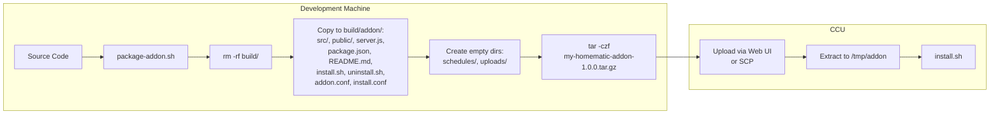
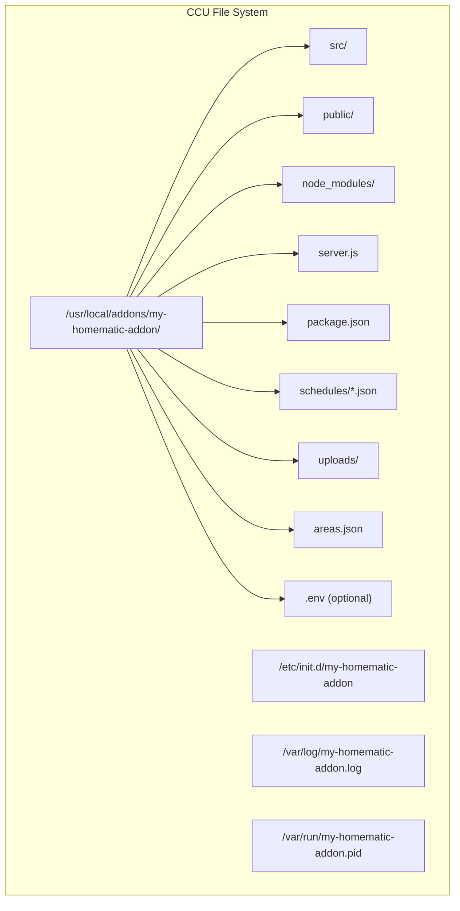

# Deployment & CCU Installation

## Prerequisites

- **Node.js >= 14** on the CCU (install the "Node.js for CCU" addon first)
- **npm** (bundled with Node.js)
- **SSH access** to the CCU (for manual installation)

## Development Setup

```bash
# Clone and install
cd my-homematic-addon
npm install

# Start the web server locally
npm run server
# -> http://localhost:3000

# Run usage examples
npm run example
```

## Build & Package

The `addon/package-addon.sh` script creates a deployable tar.gz archive:

```bash
./addon/package-addon.sh
```

**Output:** `build/my-homematic-addon-1.0.0.tar.gz`

### Build Pipeline



### Archive Contents

```
./
├── src/                  # Backend source code
├── public/               # Frontend files
├── server.js             # Express server
├── package.json          # Dependencies
├── README.md             # Documentation
├── install.sh            # Installation script
├── uninstall.sh          # Uninstallation script
├── addon.conf            # Addon metadata
├── install.conf          # Installation config
├── schedules/            # Empty (created at runtime)
└── uploads/              # Empty (created at runtime)
```

## Installation Methods

### Method 1: CCU Web UI

1. Open the CCU web interface
2. Navigate to **Addons** -> **Addon hinzufugen**
3. Select the `my-homematic-addon-1.0.0.tar.gz` file
4. The CCU runs `install.sh` automatically

### Method 2: SSH

```bash
# Copy archive to CCU
scp build/my-homematic-addon-1.0.0.tar.gz root@[CCU-IP]:/tmp/

# Connect and install
ssh root@[CCU-IP]
cd /tmp
mkdir -p addon && cd addon
tar -xzf ../my-homematic-addon-1.0.0.tar.gz
./install.sh
```

## Installation Process

The `install.sh` script performs these steps:

1. Checks for Node.js availability
2. Creates `/usr/local/addons/my-homematic-addon/`
3. Copies files from `/tmp/addon/`
4. Creates `uploads/` and `schedules/` subdirectories
5. Runs `npm install --production --no-audit --no-fund`
6. Creates an init.d script at `/etc/init.d/my-homematic-addon`
7. Registers the service (`update-rc.d` or `systemctl`)
8. Starts the addon

## CCU File System Layout



| Path                                    | Description                       |
| --------------------------------------- | --------------------------------- |
| `/usr/local/addons/my-homematic-addon/` | Addon installation directory      |
| `/etc/init.d/my-homematic-addon`        | Service init script               |
| `/var/log/my-homematic-addon.log`       | Application log (stdout + stderr) |
| `/var/run/my-homematic-addon.pid`       | PID file for process management   |

## Service Management

```bash
# Start the addon
/etc/init.d/my-homematic-addon start

# Stop the addon
/etc/init.d/my-homematic-addon stop

# Restart the addon
/etc/init.d/my-homematic-addon restart

# Check status
/etc/init.d/my-homematic-addon status
```

The init script handles:

- PID file management
- Graceful shutdown (SIGTERM, then SIGKILL after 5s)
- Automatic restart on boot (registered via `update-rc.d` or `systemctl`)
- Environment variable loading from `.env` file

## Configuration

### Environment Variables

Create a `.env` file in the addon directory to configure the connection:

**Cloud Mode:**

```env
HOMEMATIC_MODE=cloud
HOMEMATIC_IP_ACCESS_POINT_SGTIN=your-sgtin
HOMEMATIC_IP_AUTH_TOKEN=your-token
# Optional:
# HOMEMATIC_IP_CLIENT_ID=
# HOMEMATIC_IP_CLIENT_SECRET=
# HOMEMATIC_IP_API_URL=https://ps1.homematic.com:6969
```

**Local Mode:**

```env
HOMEMATIC_MODE=local
HOMEMATIC_CCU_HOST=192.168.1.100
HOMEMATIC_CCU_PORT=2001
# Optional:
# HOMEMATIC_CCU_USERNAME=
# HOMEMATIC_CCU_PASSWORD=
# HOMEMATIC_CCU_USE_TLS=false
```

**Auto Mode (default):**

```env
HOMEMATIC_MODE=auto
# Provide both cloud and/or local config
# Cloud is preferred when both are available
```

**Server:**

```env
PORT=3000
```

### JSON Config File

Alternatively, use `Config.fromFile('config.json')` with:

```json
{
  "mode": "local",
  "cloud": {
    "accessPointSGTIN": "...",
    "authToken": "..."
  },
  "local": {
    "host": "192.168.1.100",
    "port": 2001
  }
}
```

## Uninstallation

Run `uninstall.sh` or remove the addon via CCU Web UI. The script:

1. Stops the addon (if running)
2. Removes the init script `/etc/init.d/my-homematic-addon`
3. Unregisters the service
4. Removes `/usr/local/addons/my-homematic-addon/`
5. Cleans up log and PID files
6. Force-kills any remaining processes

## Troubleshooting

| Problem                          | Solution                                                                    |
| -------------------------------- | --------------------------------------------------------------------------- |
| "Node.js ist nicht installiert!" | Install the "Node.js for CCU" addon first                                   |
| npm install fails                | Check internet connectivity on CCU; try `npm install --production` manually |
| Port 3000 already in use         | Set `PORT=3001` in `.env`                                                   |
| Addon not starting after reboot  | Verify init script: `ls -la /etc/init.d/my-homematic-addon`                 |
| No devices found                 | Check `HOMEMATIC_MODE` and corresponding credentials in `.env`              |
| Connection refused (local mode)  | Verify CCU IP and that XML-RPC is enabled on port 2001                      |
| Logs                             | Check `/var/log/my-homematic-addon.log`                                     |
