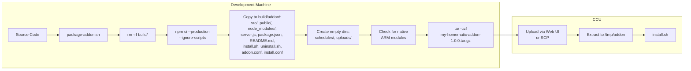
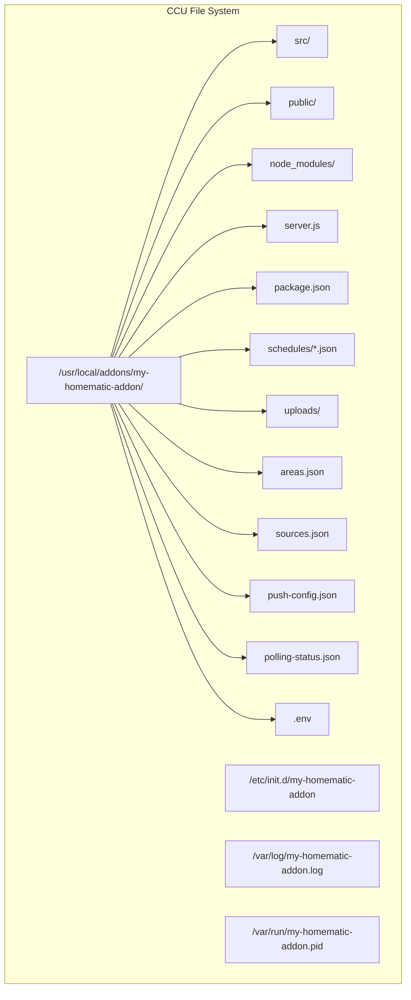

# Deployment & CCU Installation

## Prerequisites

- **Node.js >= 18** on the CCU (install the "Node.js for CCU" addon first)
- **npm** (bundled with Node.js)
- **SSH access** to the CCU (for manual installation)
- **Python 3** with `pyicloud` (optional, only for iCloud file source)

## Development Setup

```bash
# Clone and install
cd my-homematic-addon
npm install

# Start the web server locally
npm run server
# -> http://localhost:8080

# Run usage examples
npm run example

# Run tests
npm test

# Run tests in watch mode
npm run test:watch

# Lint and format
npm run lint
npm run format
```

## Build & Package

The `addon/package-addon.sh` script creates a deployable tar.gz archive:

```bash
./addon/package-addon.sh
```

**Output:** `build/my-homematic-addon-1.0.0.tar.gz`

### Build Pipeline


```mermaid
flowchart LR
    subgraph "Development Machine"
        Source["Source Code"] --> Script["package-addon.sh"]
        Script --> Clean["rm -rf build/"]
        Clean --> NPM["npm ci --production<br/>--ignore-scripts"]
        NPM --> Copy["Copy to build/addon/:<br/>src/, public/, node_modules/,<br/>server.js, package.json, README.md,<br/>install.sh, uninstall.sh,<br/>addon.conf, install.conf"]
        Copy --> Dirs["Create empty dirs:<br/>schedules/, uploads/"]
        Dirs --> Check["Check for native<br/>ARM modules"]
        Check --> Tar["tar -czf<br/>my-homematic-addon-1.0.0.tar.gz"]
    end

    subgraph "CCU"
        Tar --> Upload["Upload via Web UI<br/>or SCP"]
        Upload --> Extract["Extract to /tmp/addon"]
        Extract --> Install["install.sh"]
    end
```

### Archive Contents

```
./
├── src/                  # Backend source code
│   ├── config/           # Configuration management
│   ├── cloud/            # Cloud API client
│   ├── local/            # Local CCU client
│   ├── devices/          # Device controller
│   ├── scheduler/        # Schedule manager + heating profiles
│   ├── areas/            # Area management
│   ├── parser/           # Spreadsheet parser
│   ├── sources/          # File sources + push manager
│   ├── polling/          # Polling engine
│   └── utils/            # Logger and utilities
├── scripts/              # Python bridge scripts
├── public/               # Frontend files
├── node_modules/         # Production dependencies (pre-installed)
├── server.js             # Express server
├── package.json          # Dependencies
├── README.md             # Documentation
├── install.sh            # Installation script
├── uninstall.sh          # Uninstallation script
├── addon.conf            # Addon metadata
├── install.conf          # Installation config
├── schedules/            # Empty (created at runtime)
└── uploads/              # Empty (created at runtime)
```

## Installation Methods

### Method 1: CCU Web UI

1. Open the CCU web interface
2. Navigate to **Einstellungen** -> **Systemsteuerung** -> **Zusatzsoftware**
3. Select the `my-homematic-addon-1.0.0.tar.gz` file
4. Click **Installieren**
5. Wait until "Installation erfolgreich" appears
6. Open the Web UI: `http://[CCU-IP]:8080`

### Method 2: SSH

```bash
# Copy archive to CCU
scp build/my-homematic-addon-1.0.0.tar.gz root@[CCU-IP]:/tmp/

# Connect and install
ssh root@[CCU-IP]
cd /tmp
mkdir -p addon && cd addon
tar -xzf ../my-homematic-addon-1.0.0.tar.gz
./install.sh
```

## Installation Process

The `install.sh` script performs these steps:

1. Checks for Node.js >= 18 availability
2. Creates `/usr/local/addons/my-homematic-addon/`
3. Copies files from `/tmp/addon/`
4. Verifies `node_modules/` is present (pre-installed by build script)
5. Creates `uploads/` and `schedules/` subdirectories
6. Generates `.env` file with defaults (only adds missing variables)
7. Creates an init.d script at `/etc/init.d/my-homematic-addon`
8. Registers the service (`update-rc.d` or `systemctl`)
9. Starts the addon

## CCU File System Layout


```mermaid
graph TD
    subgraph "CCU File System"
        A["/usr/local/addons/my-homematic-addon/"]
        A --> B["src/"]
        A --> C["public/"]
        A --> D["node_modules/"]
        A --> E["server.js"]
        A --> F["package.json"]
        A --> G["schedules/*.json"]
        A --> H["uploads/"]
        A --> I["areas.json"]
        A --> J["sources.json"]
        A --> K["push-config.json"]
        A --> L["polling-status.json"]
        A --> M[".env"]

        N["/etc/init.d/my-homematic-addon"]
        O["/var/log/my-homematic-addon.log"]
        P["/var/run/my-homematic-addon.pid"]
    end
```

| Path                                    | Description                       |
| --------------------------------------- | --------------------------------- |
| `/usr/local/addons/my-homematic-addon/` | Addon installation directory      |
| `/etc/init.d/my-homematic-addon`        | Service init script               |
| `/var/log/my-homematic-addon.log`       | Application log (stdout + stderr) |
| `/var/run/my-homematic-addon.pid`       | PID file for process management   |

## Service Management

```bash
# Start the addon
/etc/init.d/my-homematic-addon start

# Stop the addon
/etc/init.d/my-homematic-addon stop

# Restart the addon
/etc/init.d/my-homematic-addon restart

# Check status
/etc/init.d/my-homematic-addon status
```

The init script handles:

- PID file management
- Graceful shutdown (SIGTERM, then SIGKILL after 5s)
- Automatic restart on boot (registered via `update-rc.d` or `systemctl`)
- Environment variable loading from `.env` file

## Configuration

### Environment Variables

Create a `.env` file in the addon directory to configure the connection:

**Essential settings:**

```env
PORT=8080
LOG_LEVEL=info
HOMEMATIC_MODE=local
HOMEMATIC_CCU_HOST=localhost
HOMEMATIC_CCU_PORT=2001
```

**Cloud Mode:**

```env
HOMEMATIC_MODE=cloud
HOMEMATIC_IP_ACCESS_POINT_SGTIN=your-sgtin
HOMEMATIC_IP_AUTH_TOKEN=your-token
# Optional:
# HOMEMATIC_IP_CLIENT_ID=
# HOMEMATIC_IP_CLIENT_SECRET=
# HOMEMATIC_IP_API_URL=https://ps1.homematic.com:6969
```

**Local Mode:**

```env
HOMEMATIC_MODE=local
HOMEMATIC_CCU_HOST=192.168.1.100
HOMEMATIC_CCU_PORT=2001
# Optional:
# HOMEMATIC_CCU_USERNAME=
# HOMEMATIC_CCU_PASSWORD=
# HOMEMATIC_CCU_USE_TLS=false
```

**Auto Mode (default):**

```env
HOMEMATIC_MODE=auto
# Provide both cloud and/or local config
# Cloud is preferred when both are available
```

| Variable                          | Description                       | Default                        |
| --------------------------------- | --------------------------------- | ------------------------------ |
| `PORT`                            | Web UI port                       | 8080                           |
| `LOG_LEVEL`                       | Log detail: debug/info/warn/error | info                           |
| `HOMEMATIC_MODE`                  | Connection mode                   | auto                           |
| `HOMEMATIC_CCU_HOST`              | CCU address                       | 192.168.1.100                  |
| `HOMEMATIC_CCU_PORT`              | XML-RPC port                      | 2001                           |
| `HOMEMATIC_CCU_USERNAME`          | CCU username                      | (none)                         |
| `HOMEMATIC_CCU_PASSWORD`          | CCU password                      | (none)                         |
| `HOMEMATIC_CCU_USE_TLS`           | Use TLS for XML-RPC               | false                          |
| `HOMEMATIC_IP_ACCESS_POINT_SGTIN` | Cloud access point SGTIN          | (none)                         |
| `HOMEMATIC_IP_AUTH_TOKEN`         | Cloud auth token                  | (none)                         |
| `HOMEMATIC_IP_CLIENT_ID`          | Cloud client ID                   | (none)                         |
| `HOMEMATIC_IP_CLIENT_SECRET`      | Cloud client secret               | (none)                         |
| `HOMEMATIC_IP_API_URL`            | Cloud API URL                     | https://ps1.homematic.com:6969 |

### JSON Config File

Alternatively, use `Config.fromFile('config.json')` with:

```json
{
  "mode": "local",
  "cloud": {
    "accessPointSGTIN": "...",
    "authToken": "..."
  },
  "local": {
    "host": "192.168.1.100",
    "port": 2001
  }
}
```

## Uninstallation

Run `uninstall.sh` or remove the addon via CCU Web UI. The script:

1. Stops the addon (if running)
2. Removes the init script `/etc/init.d/my-homematic-addon`
3. Unregisters the service
4. Removes `/usr/local/addons/my-homematic-addon/`
5. Cleans up log and PID files
6. Force-kills any remaining processes

## Troubleshooting

| Problem                                              | Solution                                                           |
| ---------------------------------------------------- | ------------------------------------------------------------------ |
| "Node.js ist nicht installiert!"                     | Install the "Node.js for CCU" addon first (>= 18)                  |
| npm install fails                                    | Build includes pre-installed node_modules; check archive integrity |
| Port 8080 already in use                             | Set `PORT=8081` in `.env`                                          |
| Addon not starting after reboot                      | Verify init script: `ls -la /etc/init.d/my-homematic-addon`        |
| No devices found                                     | Check `HOMEMATIC_MODE` and corresponding credentials in `.env`     |
| Connection refused (local mode)                      | Verify CCU IP and that XML-RPC is enabled on port 2001             |
| FRITZ!Box connection fails                           | Check FTP is enabled on FRITZ!Box; verify credentials and path     |
| iCloud login fails                                   | Ensure Python 3 with pyicloud is installed; check 2FA setup        |
| Health check: `curl http://[CCU-IP]:8080/api/health` | Returns system status and CCU connection state                     |
| Logs                                                 | Check `/var/log/my-homematic-addon.log`                            |
| Service status                                       | `ssh root@[CCU-IP] /etc/init.d/my-homematic-addon status`          |
| Restart service                                      | `ssh root@[CCU-IP] /etc/init.d/my-homematic-addon restart`         |
