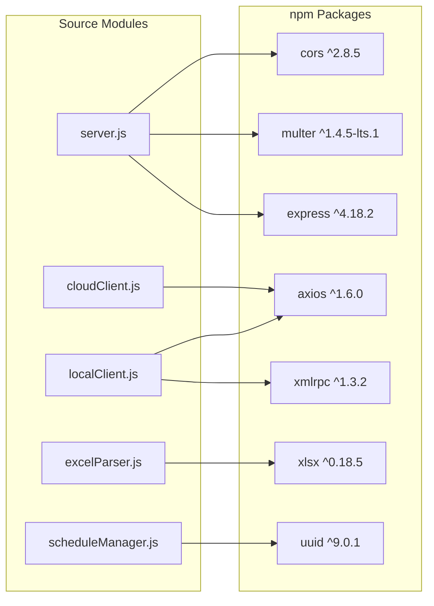

# Technology Stack & Dependencies

## Runtime & Language

| Property | Value |
|----------|-------|
| **Runtime** | Node.js >= 14.0.0 |
| **Module System** | ES Modules (`"type": "module"` in package.json) |
| **Build Step** | None -- source files are executed directly |
| **License** | MIT |

## Dependencies

| Package | Version | Purpose | Used In |
|---------|---------|---------|---------|
| **express** | ^4.18.2 | Web framework -- serves REST API (14 endpoints) and static frontend files | `server.js` |
| **axios** | ^1.6.0 | HTTP client for Homematic IP Cloud REST API | `src/cloud/cloudClient.js`, `src/local/localClient.js` |
| **xmlrpc** | ^1.3.2 | XML-RPC client for local CCU communication (`listDevices`, `getValue`, `setValue`, `getParamset`) | `src/local/localClient.js` |
| **multer** | ^1.4.5-lts.1 | Multipart file upload middleware -- disk storage, 10 MB limit, file-type filtering (.xlsx/.xls/.numbers) | `server.js` |
| **xlsx** | ^0.18.5 | Excel file parser (SheetJS) -- reads .xlsx/.xls, `sheet_to_json` for data extraction | `src/parser/excelParser.js` |
| **uuid** | ^9.0.1 | UUID v4 generation for unique schedule IDs | `src/scheduler/scheduleManager.js` |
| **ws** | ^8.14.2 | WebSocket library -- listed as dependency for potential real-time Cloud API event support | *(not actively used yet)* |
| **cors** | ^2.8.5 | CORS middleware -- enables cross-origin requests to the REST API | `server.js` |

> **Note:** There are no dev dependencies, test frameworks, linters, or build tools configured.

## Frontend Technologies

| Technology | Details |
|------------|---------|
| **HTML5** | Semantic markup, drag-and-drop file upload |
| **CSS3** | Responsive design with gradient theme (purple) |
| **JavaScript** | Vanilla ES6+, no framework or bundler |
| **HTTP Client** | Fetch API for REST communication with the backend |

## Protocols & External APIs

| Protocol | Usage | Details |
|----------|-------|---------|
| **Homematic IP Cloud REST API** | Device control via cloud | HTTPS, endpoint `https://ps1.homematic.com:6969`, Bearer token auth |
| **CCU XML-RPC** | Device control via local CCU | HTTP/HTTPS on port 2001, methods: `listDevices`, `getValue`, `setValue`, `getParamset`, `system.listMethods` |
| **Internal REST API** | Frontend-to-backend communication | Express.js on port 3000, JSON request/response |

## Dependency Usage Map

The following diagram shows which source modules depend on which npm packages:

## npm Scripts

| Script | Command | Description |
|--------|---------|-------------|
| `start` | `node src/index.js` | Run the addon directly (programmatic use) |
| `server` | `node server.js` | Start the Express web server with REST API |
| `example` | `node examples/basic-usage.js` | Run usage examples |
| `test` | *(not implemented)* | Placeholder -- exits with error |
