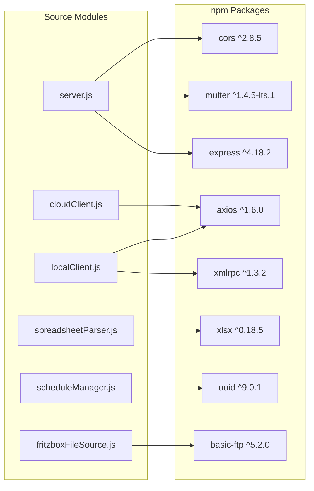

# Technology Stack & Dependencies

## Runtime & Language

| Property          | Value                                           |
| ----------------- | ----------------------------------------------- |
| **Runtime**       | Node.js >= 18.0.0                               |
| **Module System** | ES Modules (`"type": "module"` in package.json) |
| **Build Step**    | None -- source files are executed directly      |
| **License**       | MIT                                             |

## Production Dependencies

| Package       | Version      | Purpose                                                                                                  | Used In                                                |
| ------------- | ------------ | -------------------------------------------------------------------------------------------------------- | ------------------------------------------------------ |
| **express**   | ^4.18.2      | Web framework -- serves REST API (30+ endpoints) and static frontend files                               | `server.js`                                            |
| **axios**     | ^1.6.0       | HTTP client for Homematic IP Cloud REST API                                                              | `src/cloud/cloudClient.js`, `src/local/localClient.js` |
| **xmlrpc**    | ^1.3.2       | XML-RPC client for local CCU communication (`listDevices`, `getValue`, `setValue`, `getParamset`)        | `src/local/localClient.js`                             |
| **multer**    | ^1.4.5-lts.1 | Multipart file upload middleware -- disk storage, 10 MB limit, file-type filtering (.xlsx/.xls/.numbers) | `server.js`                                            |
| **xlsx**      | ^0.18.5      | Excel file parser (SheetJS) -- reads .xlsx/.xls/.numbers, `sheet_to_json` for data extraction            | `src/parser/spreadsheetParser.js`                      |
| **uuid**      | ^9.0.1       | UUID v4 generation for unique schedule IDs                                                               | `src/scheduler/scheduleManager.js`                     |
| **ws**        | ^8.14.2      | WebSocket library -- listed as dependency for potential real-time Cloud API event support                | _(not actively used yet)_                              |
| **cors**      | ^2.8.5       | CORS middleware -- enables cross-origin requests to the REST API                                         | `server.js`                                            |
| **basic-ftp** | ^5.2.0       | FTP/FTPS client for FRITZ!Box NAS file source access                                                    | `src/sources/fritzboxFileSource.js`                    |

## Dev Dependencies

| Package                | Version  | Purpose                                    |
| ---------------------- | -------- | ------------------------------------------ |
| **vitest**             | ^3.2.1   | Test framework -- unit and integration tests |
| **@vitest/coverage-v8**| ^3.2.1   | Code coverage reporting                     |
| **supertest**          | ^7.1.0   | HTTP assertion library for API tests        |
| **eslint**             | ^9.28.0  | JavaScript linter                           |
| **eslint-config-prettier** | ^10.1.5 | Disables ESLint rules conflicting with Prettier |
| **prettier**           | ^3.5.3   | Code formatter                              |

## Optional System Dependencies

| Dependency      | Required For        | Details                                          |
| --------------- | ------------------- | ------------------------------------------------ |
| **Python 3**    | iCloud file source  | Bridge to Apple's iCloud Drive API               |
| **pyicloud**    | iCloud file source  | Python library for iCloud access (`pip install pyicloud`) |

## Frontend Technologies

| Technology      | Details                                           |
| --------------- | ------------------------------------------------- |
| **HTML5**       | Semantic markup, drag-and-drop file upload        |
| **CSS3**        | Responsive design with gradient theme (purple)    |
| **JavaScript**  | Vanilla ES6+, no framework or bundler             |
| **HTTP Client** | Fetch API for REST communication with the backend |

## Protocols & External APIs

| Protocol                        | Usage                             | Details                                                                                                      |
| ------------------------------- | --------------------------------- | ------------------------------------------------------------------------------------------------------------ |
| **Homematic IP Cloud REST API** | Device control via cloud          | HTTPS, endpoint `https://ps1.homematic.com:6969`, Bearer token auth                                          |
| **CCU XML-RPC**                 | Device control via local CCU      | HTTP/HTTPS on port 2001, methods: `listDevices`, `getValue`, `setValue`, `getParamset`, `system.listMethods` |
| **FTP/FTPS**                    | FRITZ!Box NAS file access         | Port 21 (default), FTPS with `rejectUnauthorized: false`                                                    |
| **iCloud Drive API**            | iCloud file access                | Via Python bridge (`scripts/icloud_bridge.py`), supports 2FA                                                 |
| **Internal REST API**           | Frontend-to-backend communication | Express.js on port 8080, JSON request/response                                                               |

## Dependency Usage Map

The following diagram shows which source modules depend on which npm packages:

```mermaid
graph LR
    subgraph "npm Packages"
        express["express ^4.18.2"]
        axios["axios ^1.6.0"]
        xmlrpc["xmlrpc ^1.3.2"]
        multer["multer ^1.4.5-lts.1"]
        xlsxPkg["xlsx ^0.18.5"]
        uuid["uuid ^9.0.1"]
        corsPkg["cors ^2.8.5"]
        ftp["basic-ftp ^5.2.0"]
    end

    subgraph "Source Modules"
        server["server.js"]
        cloud["cloudClient.js"]
        local["localClient.js"]
        parser["spreadsheetParser.js"]
        scheduler["scheduleManager.js"]
        fritzbox["fritzboxFileSource.js"]
    end

    server --> express
    server --> multer
    server --> corsPkg
    cloud --> axios
    local --> xmlrpc
    local --> axios
    parser --> xlsxPkg
    scheduler --> uuid
    fritzbox --> ftp
```

## npm Scripts

| Script           | Command                          | Description                                    |
| ---------------- | -------------------------------- | ---------------------------------------------- |
| `start`          | `node src/index.js`              | Run the addon directly (programmatic use)      |
| `server`         | `node server.js`                 | Start the Express web server with REST API     |
| `example`        | `node examples/basic-usage.js`   | Run usage examples                             |
| `test`           | `vitest run`                     | Run all tests                                  |
| `test:watch`     | `vitest`                         | Run tests in watch mode                        |
| `test:coverage`  | `vitest run --coverage`          | Run tests with code coverage                   |
| `lint`           | `eslint .`                       | Lint all JavaScript files                      |
| `lint:fix`       | `eslint . --fix`                 | Lint and auto-fix                              |
| `format`         | `prettier --write .`             | Format all files with Prettier                 |
| `format:check`   | `prettier --check .`             | Check formatting without writing               |
