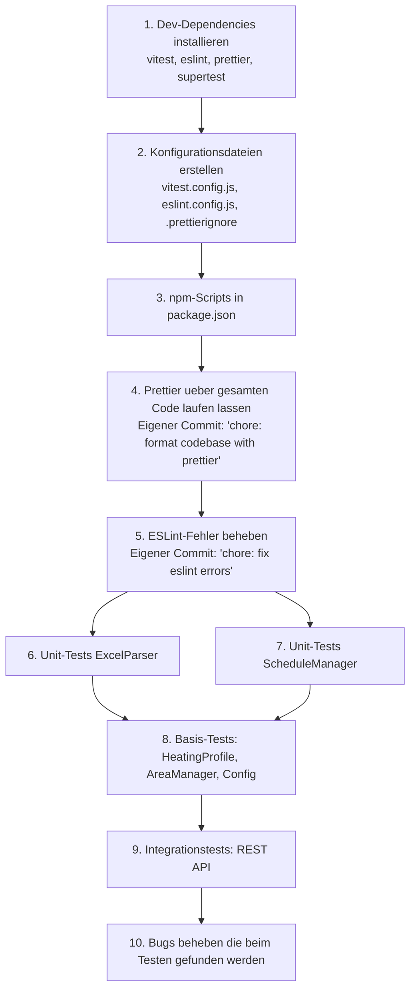

# Epic 1: Foundation -- Spezifikation

## Zusammenfassung der Entscheidungen

| Thema                   | Entscheidung                                                                         |
| ----------------------- | ------------------------------------------------------------------------------------ |
| Test-Framework          | vitest                                                                               |
| Linting                 | ESLint flat config (eslint.config.js)                                                |
| Code-Formatter          | Prettier (Standard-Defaults)                                                         |
| Node.js Mindestversion  | >= 18                                                                                |
| Test-Prioritaet         | ExcelParser, ScheduleManager (hohe Coverage); restliche Module Basis-Tests           |
| Teststruktur            | `tests/unit/` und `tests/integration/` im Projekt-Root                               |
| Test-Fixtures           | Programmatisch erzeugt (xlsx-Library im Test)                                        |
| ScheduleManager-Tests   | Temporaeres Verzeichnis + vi.useFakeTimers()                                         |
| Coverage-Ziel           | Pragmatisch: ~80%+ fuer Prio-Module, kein globales Gate                              |
| Format bestehender Code | Ja, ein grosser Prettier-Commit                                                      |
| ESLint-Strenge          | eslint:recommended + wenige Extras                                                   |
| npm-Scripts             | Komplett-Set (test, test:watch, test:coverage, lint, lint:fix, format, format:check) |

---

## 1. Dev-Dependencies installieren

### Neue devDependencies in package.json

```json
{
  "devDependencies": {
    "vitest": "^3.x",
    "@vitest/coverage-v8": "^3.x",
    "eslint": "^9.x",
    "eslint-config-prettier": "^10.x",
    "prettier": "^3.x",
    "supertest": "^7.x"
  }
}
```

### Node.js Version anheben

```json
{
  "engines": {
    "node": ">=18.0.0"
  }
}
```

---

## 2. Vitest-Konfiguration

Datei: `vitest.config.js`

```js
import { defineConfig } from "vitest/config";

export default defineConfig({
  test: {
    globals: true,
    include: ["tests/**/*.test.js"],
    coverage: {
      provider: "v8",
      include: ["src/**/*.js", "server.js"],
      exclude: ["src/parser/numbersParser.js"],
    },
  },
});
```

Anmerkungen:

- `globals: true` -- `describe`, `it`, `expect` ohne Import verfuegbar
- `numbersParser.js` ausgeschlossen -- ist ein Stub der in Epic 3 ersetzt wird
- Coverage-Provider: v8 (schneller als istanbul, keine Transformation noetig)

---

## 3. ESLint-Konfiguration

Datei: `eslint.config.js`

```js
import js from "@eslint/js";
import prettier from "eslint-config-prettier";

export default [
  js.configs.recommended,
  prettier,
  {
    languageOptions: {
      ecmaVersion: 2022,
      sourceType: "module",
      globals: {
        // Node.js globals
        console: "readonly",
        process: "readonly",
        Buffer: "readonly",
        setInterval: "readonly",
        clearInterval: "readonly",
        setTimeout: "readonly",
      },
    },
    rules: {
      "no-unused-vars": ["warn", { argsIgnorePattern: "^_" }],
      "no-console": "off",
    },
  },
  {
    ignores: ["node_modules/", "build/", "coverage/"],
  },
];
```

Anmerkungen:

- `no-console: off` -- Server-Anwendung, console.log ist gewollt
- `no-unused-vars: warn` mit `_`-Prefix-Ignore -- erlaubt `(req, _res, next)` Pattern
- `eslint-config-prettier` deaktiviert alle ESLint-Regeln die mit Prettier kollidieren

---

## 4. Prettier-Konfiguration

Keine `.prettierrc` Datei -- Standard-Defaults verwenden:

- Print width: 80
- Tab width: 2 (Spaces)
- Semikolons: ja
- Quotes: double
- Trailing commas: "all" (Prettier 3 Default)

Datei: `.prettierignore`

```
node_modules/
build/
coverage/
uploads/
schedules/
*.numbers
```

---

## 5. npm-Scripts

Neue/geaenderte Scripts in package.json:

```json
{
  "scripts": {
    "start": "node src/index.js",
    "server": "node server.js",
    "example": "node examples/basic-usage.js",
    "test": "vitest run",
    "test:watch": "vitest",
    "test:coverage": "vitest run --coverage",
    "lint": "eslint .",
    "lint:fix": "eslint . --fix",
    "format": "prettier --write .",
    "format:check": "prettier --check ."
  }
}
```

---

## 6. Teststruktur

```
tests/
  unit/
    excelParser.test.js        # Prio 1: hohe Coverage
    scheduleManager.test.js    # Prio 1: hohe Coverage
    heatingProfile.test.js     # Basis-Tests
    areaManager.test.js        # Basis-Tests
    config.test.js             # Basis-Tests
  integration/
    api.test.js                # Express-Routen via supertest
```

---

## 7. Testfaelle im Detail

### 7.1 ExcelParser (Prio 1, ~80%+ Coverage)

Fixtures werden programmatisch mit der xlsx-Library erzeugt:

**Spaltenerkennung (detectColumns):**

- Standard-Spaltennamen: Bereich, Startdatum, Enddatum, Temperatur, Heizprofil, Zusatzinfo
- Case-insensitive: BEREICH, bereich, Bereich
- Alternative Namen: Area, Zone, Raum -> area; Von, Beginn -> startDateTime
- Fehlende Pflichtspalte (Bereich) -> Fehler
- Fehlende Pflichtspalte (Startdatum) -> Fehler
- Optionale Spalten fehlen (Heizprofil, Zusatzinfo) -> kein Fehler

**Datum-Parsing (parseDateTime):**

- ISO-Format: "2025-01-15 08:00" -> korrekte Date
- ISO mit T: "2025-01-15T08:00" -> korrekte Date
- Deutsches Format: "15.01.2025 08:00" -> korrekte Date
- Excel-Seriennummer: 45672.333 -> korrekte Date
- Date-Objekt durchreichen
- Ungueltiges Format -> Fehler mit Feldname
- Leerer Wert -> Fehler

**Temperatur-Parsing (parseTemperature):**

- Ganzzahl: 21 -> 21.0
- Dezimal: 21.5 -> 21.5
- String "21.5" -> 21.5
- Unter 0 -> Fehler
- Ueber 30 -> Fehler
- Nicht-numerisch -> Fehler
- Leer/null -> Fehler

**Zeilen-Parsing (parseRow):**

- Komplette Zeile -> korrektes Objekt mit area, startDateTime (ISO), endDateTime (ISO), temperature, profile, notes
- Startdatum nach Enddatum -> Fehler
- Fehlender Bereich -> Fehler

**Gesamtparser (parse + normalizeData):**

- Programmatisch erzeugte .xlsx-Datei -> Array normalisierter Objekte
- Leere Datei -> Fehler "leer oder ungueltig"
- Datei nicht gefunden -> Fehler

### 7.2 ScheduleManager (Prio 1, ~80%+ Coverage)

Tests nutzen ein temporaeres Verzeichnis (via `fs.mkdtempSync`) und `vi.useFakeTimers()`.

**CRUD:**

- createSchedule -> erzeugt Schedule mit UUID, speichert JSON-Datei
- getSchedule -> gibt vorhandenen Schedule zurueck
- getSchedule mit unbekannter ID -> null
- getAllSchedules -> Liste aller Schedules
- deleteSchedule -> entfernt Schedule und JSON-Datei
- deleteSchedule mit unbekannter ID -> false

**Aktivierung:**

- activateSchedule -> setzt active: true, fuegt zu activeSchedules hinzu
- deactivateSchedule -> setzt active: false, entfernt aus activeSchedules
- activateSchedule ruft checkAndExecute() sofort auf

**checkAndExecute-Logik:**

- Zeitfenster aktiv (now zwischen start und end) -> setTemperature wird aufgerufen
- Zeitfenster nicht aktiv (now ausserhalb) -> kein Aufruf
- Mehrere Bereiche mit unterschiedlichen Zeitfenstern -> nur passende werden ausgefuehrt
- Kein DeviceController gesetzt -> kein Fehler, stille Rueckkehr
- DeviceController-Fehler bei einzelnem Geraet -> andere Geraete werden trotzdem bedient

**Persistenz:**

- loadAllSchedules -> laedt alle JSON-Dateien aus dem Verzeichnis
- Aktive Schedules werden nach Laden wiederhergestellt

**Timer:**

- startScheduler -> startet 60s-Intervall
- stopScheduler -> stoppt Intervall

### 7.3 HeatingProfile (Basis-Tests)

- getAllProfiles -> 4 vordefinierte Profile (Komfort, Nacht, Abwesenheit, Reduziert)
- getProfile("Komfort") -> { name, temperature: 21.0, description }
- getProfile("Unbekannt") -> null
- getTemperature("Komfort") -> 21.0
- getTemperature("Unbekannt", 19.0) -> 19.0 (Fallback)
- getTemperature("Unbekannt") ohne Fallback -> Fehler
- createProfile -> neues Profil mit custom: true
- createProfile mit Temperatur > 30 -> Fehler
- deleteProfile("Komfort") -> false (vordefiniert, nicht loeschbar)
- deleteProfile(custom) -> true
- hasProfile -> boolean

### 7.4 AreaManager (Basis-Tests)

Tests nutzen ein temporaeres Verzeichnis fuer areas.json.

- createArea -> speichert Bereich mit deviceIds, createdAt, updatedAt
- getArea -> gibt vorhandenen Bereich zurueck
- getArea unbekannt -> null
- getAllAreas -> Liste aller Bereiche
- updateArea -> aktualisiert deviceIds, updatedAt
- updateArea unbekannt -> Fehler
- deleteArea -> entfernt Bereich, speichert
- deleteArea unbekannt -> false
- resolveDevices("Wohnzimmer") mit vorhandenem Bereich -> deviceIds
- resolveDevices("DEV001,DEV002") -> ["DEV001", "DEV002"]
- resolveDevices("DEV001") -> ["DEV001"]
- hasArea -> boolean

### 7.5 Config (Basis-Tests)

- Default-Config -> mode "auto", Standard-Werte
- Cloud-Config via Constructor -> hasCloudConfig() true
- Local-Config via Constructor -> hasLocalConfig() true
- getMode() "cloud" mit Cloud-Config -> "cloud"
- getMode() "cloud" ohne Cloud-Config -> null
- getMode() "local" mit Local-Config -> "local"
- getMode() "auto" mit beiden -> "cloud" (Cloud bevorzugt)
- getMode() "auto" nur Local -> "local"
- validate() ohne Config -> errors Array nicht leer
- validate() mit gueltiger Config -> valid: true

### 7.6 REST API Integrationstests (Basis)

Via supertest gegen die Express-App (ohne echten Homematic-Client):

- GET / -> 200, HTML
- POST /api/upload ohne Datei -> 400
- POST /api/upload mit .xlsx -> 200, { success, data, count }
- POST /api/upload mit .txt -> 400 (Dateityp nicht erlaubt)
- POST /api/schedule -> 200 oder 503 (je nach Initialisierung)
- GET /api/schedules -> 200 oder 503
- GET /api/profiles -> 200 oder 503
- GET /api/areas -> 200 oder 503

Anmerkung: Die Endpunkte die den HomematicIPAddon brauchen (/api/devices, /api/schedules/:id/activate) geben 503 zurueck wenn das Addon nicht initialisiert ist. Das testen wir als korrektes Verhalten.

---

## 8. Implementierungsreihenfolge



### Commit-Strategie

1. `chore: add vitest, eslint, prettier dev dependencies`
2. `chore: add vitest, eslint, prettier config files`
3. `chore: add test and lint npm scripts`
4. `chore: format codebase with prettier`
5. `chore: fix eslint errors`
6. `test: add ExcelParser unit tests`
7. `test: add ScheduleManager unit tests`
8. `test: add HeatingProfile, AreaManager, Config unit tests`
9. `test: add REST API integration tests`
10. `fix: ...` (ein Commit pro gefundenem Bug)

---

## 9. Definition of Done

- [ ] `npm test` laeuft und alle Tests bestehen
- [ ] `npm run lint` laeuft fehlerfrei
- [ ] `npm run format:check` laeuft fehlerfrei
- [ ] `npm run test:coverage` zeigt ~80%+ fuer ExcelParser und ScheduleManager
- [ ] Alle Testfaelle aus Abschnitt 7 sind implementiert
- [ ] Keine bekannten Bugs die beim Testen entdeckt wurden sind offen
- [ ] Alle Aenderungen sind committed und gepusht
