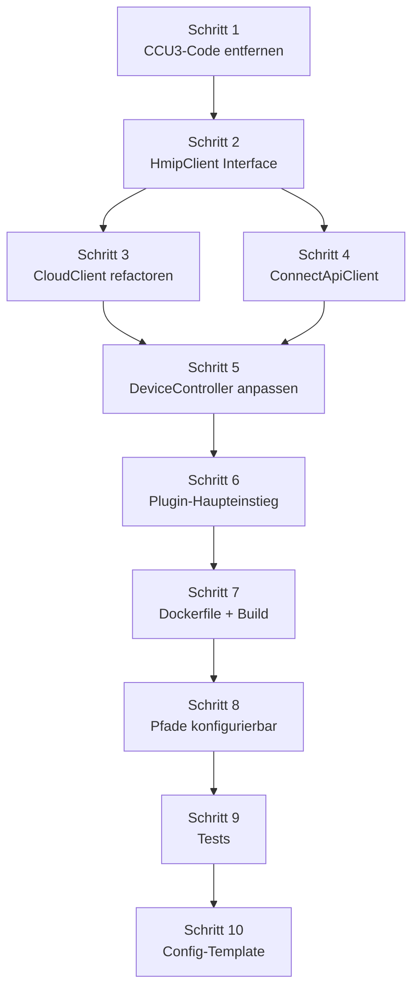

# Epic 9: HCU Connect API Plugin -- Spezifikation

## Ziel

Das Addon von einem CCU3-tar.gz-Addon zu einem HCU-Docker-Plugin migrieren, das ueber die Connect API (WebSocket) kommuniziert. Die CCU3/XML-RPC-Unterstuetzung wird entfernt, Cloud-Modus bleibt erhalten. Am Ende dieses Epics laesst sich das Plugin als Docker-Container auf der HCU installieren, zeigt Geraete an und steuert Heizgruppen-Temperaturen ueber die Connect API.

## Zusammenfassung der Entscheidungen

| Thema | Entscheidung |
|---|---|
| CCU3-Support | Entfernen (nur HCU + Cloud) |
| Client-Architektur | Adapter-Pattern mit generischem `HmipClient`-Interface |
| Deployment | Nur Dockerfile, CCU3-Build-Script entfernen |
| Authentifizierung | Automatisch im Container (`/TOKEN`), Remote-Auth-Flow fuer Entwicklung |
| Nachrichten | Minimaler Satz (Plugin-State, System-Request/Response/Event, Config) |
| HCU-UI Konfiguration | Basiskonfiguration (Dateiquellen, Polling, Profile) ueber HCU-UI |
| System-Events | Ja, Live-Updates via `hmip-system-events: true` |
| System-Requests | Heizungssteuerung + Home-Status (8 Endpunkte) |
| Web-UI | Keine eigene Web-UI, nur HCU-UI |
| Persistenz | Alles in `/data` (Container-Mount) |
| Basis-Image | `ghcr.io/homematicip/alpine-node-simple:0.0.1` |

## Voraussetzungen

- HCU mit Firmware >= 1.4.7
- Developer-Modus in HCUweb aktiviert
- Mindestens ein HmIP-Thermostat an der HCU angelernt
- Docker auf dem Entwicklungsrechner (fuer `docker buildx` mit linux/arm64)

---

## 1. CCU3-Code entfernen

### 1.1 Dateien loeschen

```
addon/                          # Komplett loeschen
  install.sh
  install.conf
  uninstall.sh
  addon.conf
  update_script
  rc.d
  package-addon.sh
src/local/localClient.js        # XML-RPC Client loeschen
public/                         # Eigene Web-UI entfernen
server.js                       # Express-Server entfernen (wird durch Plugin-Hauptdatei ersetzt)
```

### 1.2 Dependencies entfernen

Aus `package.json` entfernen:

```json
// Entfernen:
"xmlrpc": "^1.3.2",       // CCU3 XML-RPC
"express": "^4.18.2",     // Web-Server (keine eigene UI mehr)
"multer": "^1.4.5-lts.1", // File-Upload (keine eigene UI)
"cors": "^2.8.5"          // CORS (keine eigene UI)
```

Behalten:
- `ws` -- WebSocket fuer Connect API
- `axios` -- Cloud API
- `uuid` -- Nachrichten-IDs
- `xlsx` -- Excel-Parsing
- `basic-ftp` -- FRITZ!Box NAS

### 1.3 Config anpassen

`src/config/config.js` -- `getMode()` aendern:

| Modus | Vorher | Nachher |
|---|---|---|
| `cloud` | REST via axios | Bleibt |
| `local` | XML-RPC via xmlrpc | **Entfernen** |
| `hcu` | -- | **Neu: Connect API via WebSocket** |
| `auto` | Cloud > Local | Cloud > HCU |

Neue Umgebungsvariablen:
- `HOMEMATIC_MODE=hcu` -- Expliziter HCU-Modus
- `HOMEMATIC_HCU_HOST` -- HCU-Hostname (Default: `host.containers.internal` im Container, `hcu1-XXXX.local` remote)
- `HOMEMATIC_PLUGIN_ID` -- Plugin-ID (Default: `com.redlberger.hmip.heizungssteuerung`)
- `HOMEMATIC_AUTH_TOKEN` -- Auth-Token (ueberschreibt `/TOKEN` Datei)

---

## 2. Adapter-Pattern: HmipClient Interface

### 2.1 Interface-Definition

Neues Interface in `src/client/hmipClient.js`:

```javascript
/**
 * @typedef {Object} HmipDevice
 * @property {string} id - Geraete-ID
 * @property {string} name - Anzeigename
 * @property {string} type - Geraetetyp (THERMOSTAT, SWITCH, etc.)
 * @property {Object} channels - Kanalzuordnung
 */

/**
 * @typedef {Object} HmipClient
 * @property {function(): Promise<void>} connect - Verbindung herstellen
 * @property {function(): Promise<void>} disconnect - Verbindung trennen
 * @property {function(): Promise<HmipDevice[]>} getDevices - Alle Geraete abrufen
 * @property {function(string): Promise<HmipDevice>} getDevice - Ein Geraet abrufen
 * @property {function(string, number): Promise<void>} setTemperature - Temperatur setzen (groupId, temp)
 * @property {function(string, boolean): Promise<void>} setBoost - Boost-Modus (groupId, on)
 * @property {function(string, string): Promise<void>} setActiveProfile - Heizprofil aktivieren (groupId, profileIndex)
 * @property {function(string, string): Promise<void>} setControlMode - Steuerungsmodus (groupId, AUTOMATIC/MANUAL)
 * @property {function(string, boolean): Promise<void>} setSwitchState - Schalter (deviceId, on)
 * @property {function(): Promise<Object>} getSystemState - Systemstatus abrufen
 * @property {function(string, function): void} on - Event-Listener registrieren
 */
```

### 2.2 Verzeichnisstruktur (neu)

```
src/
  client/
    hmipClient.js           # Interface-Definition + JSDoc
    cloudClient.js           # Umgezogen von src/cloud/, implementiert HmipClient
    connectApiClient.js      # NEU: Connect API WebSocket Client
  devices/
    deviceController.js      # Angepasst: nutzt HmipClient-Interface
  config/
    config.js                # Angepasst: hcu-Modus
  scheduler/
    scheduleManager.js       # Unveraendert
    heatingProfile.js        # Unveraendert
  areas/
    areaManager.js           # Unveraendert
  parser/
    spreadsheetParser.js     # Unveraendert
  utils/
    logger.js                # Unveraendert
  index.js                   # Angepasst: Plugin-Haupteinstieg
```

### 2.3 CloudClient refactoren

`src/client/cloudClient.js` -- Bestehenden CloudClient so anpassen, dass er das HmipClient-Interface implementiert:

- `connect()` → ruft `authenticate()` auf
- `disconnect()` → Noop (stateless HTTP)
- `getDevices()` → Bestehende Implementierung, Rueckgabe als `HmipDevice[]` normalisieren
- `setTemperature(groupId, temp)` → `setDeviceData(...)` mit Cloud-API-Parametern
- `on(event, handler)` → Noop (Cloud hat kein Push)

### 2.4 DeviceController anpassen

`src/devices/deviceController.js` -- Statt `instanceof CloudClient`/`LocalClient` nur noch das Interface nutzen:

```javascript
// Alt:
if (this.client instanceof CloudClient) { ... }
else if (this.client instanceof LocalClient) { ... }

// Neu:
// Einheitliches Interface -- kein Typ-Check noetig
await this.client.setTemperature(groupId, temperature);
```

---

## 3. ConnectApiClient implementieren

### 3.1 Datei: `src/client/connectApiClient.js`

Kernkomponenten:

```javascript
import WebSocket from 'ws';
import { v4 as uuidv4 } from 'uuid';
import { readFileSync, existsSync } from 'fs';

export class ConnectApiClient {
  constructor(config) {
    this.pluginId = config.pluginId || 'com.redlberger.hmip.heizungssteuerung';
    this.host = config.hcuHost || 'host.containers.internal';
    this.port = config.hcuPort || 9001;
    this.authToken = config.authToken || this._readContainerToken();
    this.ws = null;
    this.pendingRequests = new Map(); // id -> { resolve, reject, timeout }
    this.eventHandlers = new Map();  // eventType -> [handler]
    this.systemState = null;         // Gecachter Systemstatus
  }
}
```

### 3.2 Verbindungsaufbau

```javascript
async connect() {
  return new Promise((resolve, reject) => {
    this.ws = new WebSocket(`wss://${this.host}:${this.port}`, {
      rejectUnauthorized: false, // Selbstsigniertes Zertifikat
      headers: {
        'authtoken': this.authToken,
        'plugin-id': this.pluginId,
        'hmip-system-events': 'true'
      }
    });

    this.ws.on('open', () => resolve());
    this.ws.on('message', (data) => this._handleMessage(JSON.parse(data)));
    this.ws.on('close', () => this._handleDisconnect());
    this.ws.on('error', (err) => reject(err));
  });
}
```

### 3.3 Nachrichten senden/empfangen

```javascript
_sendMessage(type, body = {}) {
  const id = uuidv4();
  const message = {
    pluginId: this.pluginId,
    id,
    type,
    body
  };
  this.ws.send(JSON.stringify(message));
  return id;
}

_sendRequest(type, body = {}, timeoutMs = 10000) {
  return new Promise((resolve, reject) => {
    const id = this._sendMessage(type, body);
    const timeout = setTimeout(() => {
      this.pendingRequests.delete(id);
      reject(new Error(`Zeitueberschreitung fuer ${type} (${id})`));
    }, timeoutMs);
    this.pendingRequests.set(id, { resolve, reject, timeout });
  });
}

_handleMessage(message) {
  // 1. Pending Request aufloesen
  const pending = this.pendingRequests.get(message.id);
  if (pending) {
    clearTimeout(pending.timeout);
    this.pendingRequests.delete(message.id);
    pending.resolve(message);
    return;
  }

  // 2. Eingehende Requests von der HCU
  switch (message.type) {
    case 'PLUGIN_STATE_REQUEST':
      this._handlePluginStateRequest(message);
      break;
    case 'CONFIG_TEMPLATE_REQUEST':
      this._handleConfigTemplateRequest(message);
      break;
    case 'CONFIG_UPDATE_REQUEST':
      this._handleConfigUpdateRequest(message);
      break;
    case 'STATUS_REQUEST':
      this._handleStatusRequest(message);
      break;
    case 'HMIP_SYSTEM_EVENT':
      this._handleSystemEvent(message);
      break;
    case 'INCLUSION_EVENT':
      this._handleInclusionEvent(message);
      break;
    case 'EXCLUSION_EVENT':
      this._handleExclusionEvent(message);
      break;
  }
}
```

### 3.4 Plugin-Lebenszyklus-Handler

```javascript
_handlePluginStateRequest(message) {
  this._sendMessage('PLUGIN_STATE_RESPONSE', {
    pluginReadinessStatus: 'READY',
    friendlyName: {
      de: 'Heizungssteuerung',
      en: 'Heating Control'
    }
  });
}
```

### 3.5 Konfigurations-Template

```javascript
_handleConfigTemplateRequest(message) {
  this._sendMessage('CONFIG_TEMPLATE_RESPONSE', {
    properties: {
      pollingInterval: {
        dataType: 'INTEGER',
        friendlyName: 'Polling-Intervall (Minuten)',
        description: 'Wie oft Dateiquellen geprueft werden',
        defaultValue: '60',
        minimum: 5,
        maximum: 1440,
        required: false,
        groupId: 'general',
        order: 1
      },
      defaultTemperature: {
        dataType: 'NUMBER',
        friendlyName: 'Standard-Temperatur (°C)',
        description: 'Fallback-Temperatur wenn kein Zeitplan aktiv',
        defaultValue: '20',
        minimum: 5,
        maximum: 30,
        required: false,
        groupId: 'heating',
        order: 2
      },
      fritzboxHost: {
        dataType: 'STRING',
        friendlyName: 'FRITZ!Box IP',
        description: 'IP-Adresse der FRITZ!Box fuer NAS-Zugriff',
        defaultValue: '192.168.178.1',
        required: false,
        groupId: 'sources',
        order: 3
      },
      fritzboxUser: {
        dataType: 'STRING',
        friendlyName: 'FRITZ!Box Benutzer',
        required: false,
        groupId: 'sources',
        order: 4
      },
      fritzboxPassword: {
        dataType: 'PASSWORD',
        friendlyName: 'FRITZ!Box Passwort',
        required: false,
        groupId: 'sources',
        order: 5
      },
      fritzboxPath: {
        dataType: 'STRING',
        friendlyName: 'NAS-Pfad',
        description: 'Pfad auf der FRITZ!Box NAS (z.B. FRITZ.NAS/Heizung/)',
        defaultValue: 'FRITZ.NAS/Heizung/',
        required: false,
        groupId: 'sources',
        order: 6
      }
    },
    groups: {
      general: {
        friendlyName: 'Allgemein',
        order: 1
      },
      heating: {
        friendlyName: 'Heizung',
        order: 2
      },
      sources: {
        friendlyName: 'Dateiquellen',
        description: 'Konfiguration der externen Dateiquellen',
        order: 3
      }
    }
  });
}
```

### 3.6 HmIP System Requests (Heizungssteuerung)

```javascript
async _systemRequest(path, body) {
  const response = await this._sendRequest('HMIP_SYSTEM_REQUEST', { path, body });
  if (response.body?.code !== 200) {
    const errorCode = response.body?.body?.errorCode || 'UNKNOWN';
    throw new Error(`HmIP System-Fehler: ${errorCode} (Code ${response.body?.code})`);
  }
  return response.body?.body;
}

// -- HmipClient Interface-Methoden --

async getSystemState() {
  const state = await this._systemRequest('/hmip/home/getSystemState', {});
  this.systemState = state;
  return state;
}

async setTemperature(groupId, temperature) {
  return this._systemRequest('/hmip/group/heating/setSetPointTemperature', {
    groupId,
    setPointTemperature: Math.max(5, Math.min(30, temperature))
  });
}

async setBoost(groupId, boost) {
  return this._systemRequest('/hmip/group/heating/setBoost', {
    groupId,
    boost
  });
}

async setActiveProfile(groupId, profileIndex) {
  return this._systemRequest('/hmip/group/heating/setActiveProfile', {
    groupId,
    profileIndex  // 'PROFILE_1' bis 'PROFILE_6'
  });
}

async setControlMode(groupId, controlMode) {
  return this._systemRequest('/hmip/group/heating/setControlMode', {
    groupId,
    controlMode  // 'AUTOMATIC' oder 'MANUAL'
  });
}

async activateAbsence() {
  return this._systemRequest('/hmip/home/heating/activateAbsencePermanent', {});
}

async deactivateAbsence() {
  return this._systemRequest('/hmip/home/heating/deactivateAbsence', {});
}

async setSwitchState(deviceId, on, channelIndex = 1) {
  return this._systemRequest('/hmip/device/control/setSwitchState', {
    deviceId,
    channelIndex,
    on
  });
}
```

### 3.7 System-Events verarbeiten

```javascript
_handleSystemEvent(message) {
  const transaction = message.body?.eventTransaction;
  if (!transaction?.events) return;

  for (const [, event] of Object.entries(transaction.events)) {
    switch (event.pushEventType) {
      case 'DEVICE_CHANGED':
        this._emit('deviceChanged', event.device);
        break;
      case 'GROUP_CHANGED':
        this._emit('groupChanged', event.group);
        break;
      case 'DEVICE_ADDED':
        this._emit('deviceAdded', event.device);
        break;
      case 'DEVICE_REMOVED':
        this._emit('deviceRemoved', event.id);
        break;
    }
  }
}

on(event, handler) {
  if (!this.eventHandlers.has(event)) {
    this.eventHandlers.set(event, []);
  }
  this.eventHandlers.get(event).push(handler);
}

_emit(event, data) {
  const handlers = this.eventHandlers.get(event) || [];
  for (const handler of handlers) {
    handler(data);
  }
}
```

### 3.8 Geraete aus Systemstatus extrahieren

```javascript
async getDevices() {
  if (!this.systemState) {
    await this.getSystemState();
  }

  const devices = [];
  for (const [id, device] of Object.entries(this.systemState.devices || {})) {
    devices.push(this._normalizeDevice(id, device));
  }
  return devices;
}

_normalizeDevice(id, raw) {
  // Connect API Geraetestruktur zu HmipDevice normalisieren
  return {
    id,
    name: raw.label || raw.type || id,
    type: raw.type,
    channels: raw.functionalChannels || {},
    // Heizungsrelevante Werte extrahieren
    temperature: this._extractTemperature(raw),
    setPointTemperature: this._extractSetPoint(raw),
    humidity: this._extractHumidity(raw),
  };
}
```

### 3.9 Container-Token lesen

```javascript
_readContainerToken() {
  // Im HCU-Container: Token aus /TOKEN lesen
  const tokenPath = '/TOKEN';
  if (existsSync(tokenPath)) {
    return readFileSync(tokenPath, 'utf-8').trim();
  }
  return null;
}
```

### 3.10 Reconnect-Logik

```javascript
_handleDisconnect() {
  this._emit('disconnected');
  // Exponentielles Backoff: 1s, 2s, 4s, 8s, max 60s
  const delay = Math.min(60000, 1000 * Math.pow(2, this.reconnectAttempts));
  this.reconnectAttempts++;
  setTimeout(() => this.connect().catch(() => {}), delay);
}
```

---

## 4. Remote-Auth-Flow (Entwicklung)

Fuer die Entwicklung auf dem lokalen Rechner (nicht im Container) muss der Auth-Flow manuell durchlaufen werden.

### 4.1 Auth-Modul: `src/client/connectApiAuth.js`

```javascript
import axios from 'axios';

export class ConnectApiAuth {
  constructor(hcuHost) {
    this.baseUrl = `https://${hcuHost}:6969`;
    this.httpsAgent = new (await import('https')).Agent({ rejectUnauthorized: false });
  }

  async requestToken(activationKey, pluginId, friendlyName) {
    const response = await axios.post(
      `${this.baseUrl}/hmip/auth/requestConnectApiAuthToken`,
      { activationKey, pluginId, friendlyName },
      { headers: { VERSION: '12' }, httpsAgent: this.httpsAgent }
    );
    return response.data.authToken;
  }

  async confirmToken(activationKey, authToken) {
    const response = await axios.post(
      `${this.baseUrl}/hmip/auth/confirmConnectApiAuthToken`,
      { activationKey, authToken },
      { headers: { VERSION: '12' }, httpsAgent: this.httpsAgent }
    );
    return response.data.clientId;
  }
}
```

### 4.2 CLI-Auth-Script: `scripts/auth-hcu.js`

Ein einfaches CLI-Script fuer die Ersteinrichtung:

```javascript
// Aufruf: node scripts/auth-hcu.js hcu1-XXXX.local ABCDEF
// 1. Fordert Token an
// 2. Bestaetigt Token
// 3. Speichert Token in .env als HOMEMATIC_AUTH_TOKEN
```

---

## 5. Plugin-Haupteinstieg

### 5.1 Datei: `src/index.js` (umgeschrieben)

```javascript
import { Config } from './config/config.js';
import { ConnectApiClient } from './client/connectApiClient.js';
import { CloudClient } from './client/cloudClient.js';
import { DeviceController } from './devices/deviceController.js';
import { ScheduleManager } from './scheduler/scheduleManager.js';
import { AreaManager } from './areas/areaManager.js';
import { HeatingProfile } from './scheduler/heatingProfile.js';

export class HomematicIPPlugin {
  constructor(options = {}) {
    this.config = new Config(options);
    this.client = null;
    this.deviceController = null;
    this.scheduleManager = null;
    this.areaManager = null;
  }

  async start() {
    // 1. Client erstellen
    const mode = this.config.getMode();
    if (mode === 'hcu') {
      this.client = new ConnectApiClient(this.config);
    } else if (mode === 'cloud') {
      this.client = new CloudClient(this.config);
    } else {
      throw new Error(`Unbekannter Modus: ${mode}`);
    }

    // 2. Verbinden
    await this.client.connect();

    // 3. Module initialisieren
    const dataDir = process.env.DATA_DIR || '/data';
    this.areaManager = new AreaManager(`${dataDir}/areas.json`);
    this.deviceController = new DeviceController(this.client);
    this.scheduleManager = new ScheduleManager(
      this.deviceController,
      this.areaManager,
      HeatingProfile,
      `${dataDir}/schedules`
    );

    // 4. Zeitplan-Ausfuehrungsschleife starten
    this.scheduleManager.startExecutionLoop();

    console.log(`Plugin gestartet im Modus: ${mode}`);
  }

  async stop() {
    this.scheduleManager?.stopExecutionLoop();
    await this.client?.disconnect();
  }
}

// Direkter Start
const plugin = new HomematicIPPlugin();
plugin.start().catch((err) => {
  console.error('Plugin-Start fehlgeschlagen:', err.message);
  process.exit(1);
});
```

---

## 6. Dockerfile

### 6.1 Datei: `Dockerfile`

```dockerfile
# Stage 1: Dependencies installieren
FROM ghcr.io/homematicip/alpine-node-simple:0.0.1 AS builder
WORKDIR /app
COPY package.json package-lock.json ./
RUN npm ci --omit=dev --ignore-scripts

# Stage 2: Finales Image
FROM ghcr.io/homematicip/alpine-node-simple:0.0.1
WORKDIR /app

COPY --from=builder /app/node_modules ./node_modules
COPY src/ ./src/
COPY package.json ./

# Persistenter Speicher
VOLUME /data

# Plugin-Metadaten
LABEL de.eq3.hmip.plugin.metadata='{ \
  "pluginId": "com.redlberger.hmip.heizungssteuerung", \
  "issuer": "Roman Redlberger", \
  "version": "1.0.0", \
  "hcuMinVersion": "1.4.7", \
  "scope": "LOCAL", \
  "friendlyName": { \
    "de": "Heizungssteuerung", \
    "en": "Heating Control" \
  }, \
  "description": { \
    "de": "Heizungszeitplaene aus Excel/Numbers-Dateien auslesen und Homematic IP Thermostate steuern.", \
    "en": "Read heating schedules from Excel/Numbers files and control Homematic IP thermostats." \
  }, \
  "settings": {}, \
  "image": "", \
  "changelog": { \
    "1.0.0": { \
      "de": "Erstversion mit Connect API Unterstuetzung", \
      "en": "Initial release with Connect API support" \
    } \
  }, \
  "logsEnabled": true \
}'

# Umgebungsvariablen
ENV HOMEMATIC_MODE=hcu
ENV DATA_DIR=/data
ENV NODE_ENV=production

CMD ["node", "src/index.js"]
```

### 6.2 Datei: `.dockerignore`

```
node_modules
build
.git
.env
*.md
specs
docs
examples
tests
public
addon
server.js
.claude
```

### 6.3 Build-Script: `scripts/build-hcu-plugin.sh`

```bash
#!/bin/bash
# Baut das HCU-Plugin als Docker-Image fuer linux/arm64

PLUGIN_NAME="com.redlberger.hmip.heizungssteuerung"
VERSION="1.0.0"
IMAGE_NAME="heizungssteuerung-plugin"

echo "Baue HCU-Plugin ${IMAGE_NAME}:${VERSION}..."

# Baue fuer ARM64 (HCU-Plattform)
docker buildx build \
  --platform linux/arm64 \
  --tag "${IMAGE_NAME}:${VERSION}" \
  --tag "${IMAGE_NAME}:latest" \
  --load \
  .

if [ $? -eq 0 ]; then
  echo ""
  echo "=========================================="
  echo "Plugin erfolgreich gebaut!"
  echo "=========================================="
  echo "Image: ${IMAGE_NAME}:${VERSION}"
  echo "Groesse: $(docker image inspect ${IMAGE_NAME}:${VERSION} --format='{{.Size}}' | numfmt --to=iec 2>/dev/null || echo 'unbekannt')"
  echo ""
  echo "Deployment auf HCU:"
  echo "  1. Image exportieren: docker save ${IMAGE_NAME}:${VERSION} | gzip > ${IMAGE_NAME}-${VERSION}.tar.gz"
  echo "  2. Auf HCU laden (Details in HCU-Dokumentation)"
  echo "=========================================="
else
  echo "FEHLER: Build fehlgeschlagen!"
  exit 1
fi
```

---

## 7. Pfade konfigurierbar machen

### 7.1 DATA_DIR Umgebungsvariable

Alle Module die Dateipfade nutzen muessen `DATA_DIR` beruecksichtigen:

| Modul | Aktueller Pfad | Neuer Pfad |
|---|---|---|
| ScheduleManager | `schedules/` | `${DATA_DIR}/schedules/` |
| AreaManager | `areas.json` | `${DATA_DIR}/areas.json` |
| Upload-Verzeichnis | `uploads/` | `${DATA_DIR}/uploads/` |

### 7.2 Anpassung in den Modulen

```javascript
// ScheduleManager Konstruktor:
constructor(deviceController, areaManager, heatingProfile, schedulesDir) {
  this.schedulesDir = schedulesDir || path.join(process.env.DATA_DIR || '.', 'schedules');
}

// AreaManager Konstruktor:
constructor(filePath) {
  this.filePath = filePath || path.join(process.env.DATA_DIR || '.', 'areas.json');
}
```

---

## 8. Tests

### 8.1 Unit-Tests fuer ConnectApiClient

Datei: `tests/connectApiClient.test.js`

| Test | Beschreibung |
|---|---|
| `sendet PluginMessage-Envelope korrekt` | Prueft pluginId, id (UUID), type, body |
| `beantwortet PLUGIN_STATE_REQUEST mit READY` | Simuliert eingehende Nachricht, prueft Antwort |
| `loest pending Request bei passender ID auf` | Sendet Request, simuliert Response mit gleicher ID |
| `wirft Fehler bei Timeout` | Sendet Request, wartet auf Timeout |
| `verarbeitet HMIP_SYSTEM_EVENT korrekt` | Simuliert Event-Transaction, prueft Event-Emission |
| `normalisiert Geraete aus Systemstatus` | Mock-Systemstatus, prueft HmipDevice-Format |
| `liest Token aus /TOKEN Datei` | Mock-Dateisystem, prueft Token-Lesung |
| `reconnect bei Verbindungsabbruch` | Simuliert WebSocket-Close, prueft Reconnect |

### 8.2 Unit-Tests fuer HmipClient-Interface

Datei: `tests/hmipClient.test.js`

| Test | Beschreibung |
|---|---|
| `CloudClient implementiert HmipClient` | Prueft alle Interface-Methoden |
| `ConnectApiClient implementiert HmipClient` | Prueft alle Interface-Methoden |
| `DeviceController funktioniert mit beiden Clients` | Gleicher Test mit verschiedenen Client-Implementierungen |

### 8.3 Integrationstests

Datei: `tests/connectApiIntegration.test.js`

Mock-WebSocket-Server simuliert die HCU:

| Test | Beschreibung |
|---|---|
| `Verbindung mit Auth-Token` | WebSocket-Verbindung + Header-Pruefung |
| `getSystemState Roundtrip` | Request → Mock-Response → Ergebnis |
| `setSetPointTemperature` | Request-Body + Path pruefung |
| `System-Event Verarbeitung` | Mock-Event → Event-Handler aufgerufen |

---

## Implementierungsreihenfolge



| Schritt | Beschreibung | Geschaetzte Dateien |
|---|---|---|
| 1 | CCU3-Code entfernen (addon/, local/, public/, server.js) | Loeschen: ~15 Dateien |
| 2 | HmipClient Interface definieren | Neu: `src/client/hmipClient.js` |
| 3 | CloudClient refactoren auf HmipClient | Aendern: `src/client/cloudClient.js` |
| 4 | ConnectApiClient implementieren | Neu: `src/client/connectApiClient.js`, `src/client/connectApiAuth.js` |
| 5 | DeviceController anpassen | Aendern: `src/devices/deviceController.js` |
| 6 | Plugin-Haupteinstieg umschreiben | Aendern: `src/index.js` |
| 7 | Dockerfile + Build-Script + .dockerignore | Neu: `Dockerfile`, `scripts/build-hcu-plugin.sh`, `.dockerignore` |
| 8 | Pfade konfigurierbar (DATA_DIR) | Aendern: ScheduleManager, AreaManager |
| 9 | Tests schreiben | Neu: 3 Test-Dateien |
| 10 | Config-Template fuer HCU-UI | In ConnectApiClient (bereits in Schritt 4) |

## Commit-Strategie

```
1. chore: remove CCU3 addon files and XML-RPC local client
2. feat: add HmipClient interface definition
3. refactor: adapt CloudClient to HmipClient interface
4. feat: implement ConnectApiClient with WebSocket messaging
5. refactor: adapt DeviceController to use HmipClient interface
6. refactor: rewrite plugin entry point for HCU mode
7. feat: add Dockerfile and HCU build script
8. refactor: make data paths configurable via DATA_DIR
9. test: add ConnectApiClient and HmipClient integration tests
10. feat: add HCU config template for plugin settings
```

## Definition of Done

- [ ] CCU3-Code komplett entfernt (addon/, localClient, server.js, public/)
- [ ] `xmlrpc`, `express`, `multer`, `cors` aus Dependencies entfernt
- [ ] HmipClient Interface definiert und von CloudClient + ConnectApiClient implementiert
- [ ] ConnectApiClient verbindet sich per WebSocket und handhabt alle relevanten Nachrichtentypen
- [ ] Plugin-Lebenszyklus funktioniert (PLUGIN_STATE_REQUEST → READY)
- [ ] System-Requests funktionieren (getSystemState, setSetPointTemperature, setBoost, setActiveProfile, setControlMode)
- [ ] System-Events werden empfangen und verarbeitet (DEVICE_CHANGED, GROUP_CHANGED)
- [ ] Config-Template wird an die HCU geliefert (Polling, Temperatur, FRITZ!Box)
- [ ] Dockerfile baut erfolgreich fuer linux/arm64
- [ ] Docker LABEL mit Plugin-Metadaten vorhanden
- [ ] Persistente Daten in `/data` (Zeitplaene, Bereiche, Config)
- [ ] Alle Pfade konfigurierbar ueber DATA_DIR
- [ ] `npm test` laeuft und besteht
- [ ] `npm run lint` fehlerfrei
- [ ] Remote-Auth-Script vorhanden (`scripts/auth-hcu.js`)
- [ ] Reconnect-Logik bei Verbindungsabbruch
