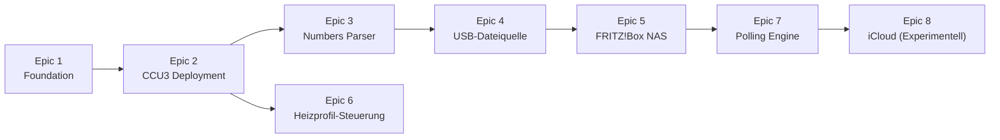

# Roadmap: Homematic IP Heating Control Addon

## Vision

Ein CCU3-Addon das Heizungszeitplaene aus Apple Numbers oder Excel-Dateien liest -- gespeichert in iCloud, auf einem USB-Stick an der CCU oder auf der FRITZ!Box NAS -- und die Homematic IP Thermostate entsprechend steuert. Sowohl direkte Temperatursteuerung als auch Heizprofil-Aktivierung auf den Geraeten werden unterstuetzt.

## Aktueller Stand

Das Projekt hat einen funktionierenden Prototyp:

- Express-Webserver mit REST API und Web-UI
- Excel-Parser mit automatischer Spaltenerkennung
- Zeitplan-Manager mit 60-Sekunden-Ausfuehrungsschleife
- Dual-Client-Architektur (Cloud API + lokale CCU via XML-RPC)
- Dateibasierte Persistenz (schedules/\*.json, areas.json)

**Was fehlt:**

- Keine Tests, kein Linting
- Nie auf echter CCU3-Hardware installiert
- Numbers-Parser ist ein Stub (versucht xlsx-Library, schlaegt fehl)
- Keine Dateiquellen-Integration (USB, FRITZ!Box, iCloud)
- Nur direkte Temperatursteuerung, keine Heizprofil-Kontrolle auf Geraeten

## Entscheidungen

| Thema             | Entscheidung                                                                               |
| ----------------- | ------------------------------------------------------------------------------------------ |
| Ziel-Hardware     | CCU3 (original eQ-3)                                                                       |
| Tabellenformat    | Numbers + Excel, Schema: Bereich, Startdatum, Enddatum, Temperatur, Heizprofil, Zusatzinfo |
| Dateiquellen      | iCloud, USB an CCU, FRITZ!Box NAS -- alle drei gleichwertig                                |
| Polling-Intervall | Stuendlich auf Datei-Aenderungen pruefen                                                   |
| Steuerungsart     | Direkte Temperatur UND Heizprofil-Aktivierung                                              |
| Sprache           | Deutsch durchgehend (UI, Fehlermeldungen, Doku)                                            |

---

## Epic-Abhaengigkeiten

Epics 3 und 6 koennen parallel nach Epic 2 bearbeitet werden. Der Dateiquellen-Track (4 -> 5 -> 7 -> 8) ist sequenziell, da jedes Epic auf der vorherigen Abstraktion aufbaut.

---

## Epic 1: Foundation -- Tests, Linting, Code-Stabilisierung

**Ziel:** Ein Sicherheitsnetz schaffen, damit alle weiteren Epics mit Vertrauen entwickelt und verifiziert werden koennen.

**Umfang:**

- Test-Framework einrichten (vitest oder node:test) mit npm-Scripts
- ESLint mit sinnvoller Konfiguration fuer ES Modules einrichten
- Unit-Tests fuer Module ohne externe Abhaengigkeiten: ExcelParser (Spaltenerkennung, Datumsformate, Temperaturvalidierung), HeatingProfile (Profil-Lookup, Temperaturaufloesung), AreaManager (CRUD, resolveDevices-Logik)
- Unit-Tests fuer ScheduleManager mit gemocktem DeviceController -- Zeitplan-CRUD, checkAndExecute-Zeitfensterlogik, Aktiv/Inaktiv-Umschaltung
- Integrationstests fuer Express-Routen in server.js (supertest) -- Upload, Zeitplan-CRUD, Bereichs-CRUD
- Bugs beheben die beim Testschreiben entdeckt werden

**Abhaengigkeiten:** Keine -- dies ist der Startpunkt.

**Fertig wenn:**

- `npm test` laeuft und besteht
- `npm run lint` laeuft fehlerfrei
- Testabdeckung existiert fuer ExcelParser, HeatingProfile, AreaManager, ScheduleManager und REST-API-Routen

---

## Epic 2: Verifiziertes CCU3-Deployment

**Ziel:** Sicherstellen, dass das Addon auf echter CCU3-Hardware installiert, startet und korrekt laeuft.

**Umfang:**

- Build-Script (package-addon.sh) und resultierendes tar.gz auf realer CCU3 testen
- Node.js-Verfuegbarkeit auf CCU3 pruefen (Voraussetzung: "Node.js fuer CCU"-Addon)
- install.sh ueberarbeiten: `npm install --production` braucht Internet und Speicherplatz auf CCU3 -- evaluieren ob node_modules vorgebundelt ins tar.gz gehoeren
- init.d-Service pruefen: Start beim Boot, Neustart-Ueberlebenstest, Logging nach /var/log/
- XML-RPC Local-Client testen: Verbindung zu localhost:2001 (CCU3 eigener RPC-Server)
- Web-UI-Erreichbarkeit unter http://[CCU-IP]:3000 sicherstellen
- Verifizierte Installationsanleitung dokumentieren

**Abhaengigkeiten:** Epic 1 (damit gefundene Bugs mit Testabdeckung behoben werden koennen)

**Fertig wenn:**

- Addon installiert sich ueber CCU3-Weboberfläche ("Zusatzsoftware")
- Service startet automatisch nach Reboot
- Web-UI laedt und kann reale Geraete von der lokalen CCU auflisten
- Ein manuell erstellter Bereich + hochgeladener Excel-Zeitplan aktiviert sich und setzt eine Temperatur an einem echten Thermostat

---

## Epic 3: Nativer Apple Numbers Parser

**Ziel:** Den NumbersParser-Stub durch eine echte Implementierung ersetzen, die .numbers-Dateien parsen kann.

**Umfang:**

- Evaluierung von .numbers-Parsing-Bibliotheken (Kandidaten: `numbers-parser` npm-Paket, oder Python-Bridge ueber child_process mit Pythons `numbers-parser`)
- Falls keine zuverlaessige Node.js-Bibliothek existiert: minimalen Protobuf-Reader fuer die benoetigten Tabellendaten implementieren oder Python-Wrapper
- Parser muss exakt die gleiche normalisierte Ausgabe wie ExcelParser.normalizeData() liefern -- gleiche Feldnamen (area, startDateTime, endDateTime, temperature, profile, notes)
- Validierung gegen die vorhandene Beispieldatei examples/HmIP-Sondertermine.numbers
- Tests die die .numbers-Datei parsen und die Ausgabe gegen erwartete Daten pruefen

**Abhaengigkeiten:** Epic 1 (Tests), Epic 2 (Pruefen ob Python auf CCU3 verfuegbar ist -- beeinflusst die Implementierungswahl)

**Fertig wenn:**

- Upload von HmIP-Sondertermine.numbers ueber die Web-UI liefert die gleichen Zeitplandaten wie eine aequivalente .xlsx-Datei
- Tests bestehen fuer den Numbers-Parser mit der Beispieldatei
- Fehlermeldungen bleiben auf Deutsch

---

## Epic 4: USB-Laufwerk als Dateiquelle

**Ziel:** Das Addon erkennt und liest Tabellendateien von einem an der CCU3 angeschlossenen USB-Stick.

**Umfang:**

- FileSourceManager-Abstraktion erstellen mit einheitlichem Interface (listFiles(), readFile(), getChecksum()) das alle drei Dateiquellen implementieren
- UsbFileSource implementieren: USB-Laufwerke auf CCU3 erkennen (/dev/sd*, /media/usb*), bei Bedarf mounten, nach .numbers/.xlsx-Dateien in konfigurierbarem Pfad suchen
- Konfigurations-UI im Web-Frontend: Mount-Point, Unterordner-Pfad, Aktivieren/Deaktivieren
- Integration mit stuendlichem Polling (neuer Mechanismus, getrennt von der bestehenden 60s-Zeitplan-Schleife)
- Bei neuer oder geaenderter Datei: automatisch parsen und entsprechenden Zeitplan erstellen/aktualisieren
- USB-Entfernung robust behandeln (kein Absturz)

**Abhaengigkeiten:** Epic 3 (Numbers-Parser muss funktionieren), Epic 2 (muss auf CCU3 laufen)

**Fertig wenn:**

- USB-Stick mit .numbers-Datei an CCU3 anstecken fuehrt dazu, dass der Zeitplan innerhalb eines Polling-Zyklus (oder bei manuellem Trigger) in der Web-UI erscheint
- Entfernen des USB-Sticks verursacht keinen Absturz
- Konfiguration ist persistent und ueberlebt Neustarts

---

## Epic 5: FRITZ!Box NAS als Dateiquelle

**Ziel:** Das Addon liest Tabellendateien von einem FRITZ!Box NAS-Share.

**Umfang:**

- FritzboxFileSource implementieren ueber das FileSourceManager-Interface aus Epic 4
- Zugriff via FTP (primaer, da FRITZ!Box FTP auf Port 21 anbietet und auf CCU3 einfacher) oder SMB/CIFS (Fallback)
- Konfigurations-UI: FRITZ!Box IP, Zugangsdaten (Benutzer/Passwort), Pfad auf dem NAS, Polling-Toggle
- Hinweis in der UI dass Zugangsdaten im Klartext gespeichert werden
- Gleiches stuendliches Polling und Auto-Parse-Verhalten wie USB-Quelle

**Abhaengigkeiten:** Epic 4 (FileSourceManager-Abstraktion), Epic 3 (Numbers-Parser)

**Fertig wenn:**

- Eine .numbers- oder .xlsx-Datei auf der FRITZ!Box NAS (z.B. in FRITZ.NAS/Heizung/) wird erkannt und in einen Zeitplan geparst
- Verbindungsfehler werden deutlich in der Web-UI angezeigt
- Funktioniert mit FTP-Zugang

---

## Epic 6: Heizprofil-Steuerung auf Geraeten

**Ziel:** Neben der bestehenden direkten Temperatursteuerung auch Heizprofile (Wochenprogramme) direkt auf HmIP-Thermostaten setzen koennen.

**Umfang:**

- HmIP-Thermostat XML-RPC-Schnittstelle fuer Profilsteuerung recherchieren: ACTIVE_PROFILE, SET_POINT_MODE, Wochenprogramm-Parameter via putParamset
- DeviceController um setHeatingProfile(deviceId, profileData) erweitern
- Zeitplan-Datenmodell erweitern: ein Eintrag kann jetzt entweder eine direkte Temperatur ODER ein zu aktivierendes Heizprofil angeben
- ScheduleManager.checkAndExecute() fuer beide Steuerungsarten anpassen
- Spaltenauswertung erweitern: die Heizprofil-Spalte kann jetzt Geraete-Heizprofile referenzieren, nicht nur die internen Temperatur-Presets des Addons
- Web-UI aktualisieren: Anzeige welcher Steuerungsmodus je Zeitplan-Eintrag verwendet wird

**Abhaengigkeiten:** Epic 2 (Zugang zu realer Hardware), Epic 1 (Tests)

**Fertig wenn:**

- Ein Zeitplan-Eintrag mit Heizprofil kann entweder (a) eine direkte Temperatur setzen (bestehend) oder (b) ein Heizprofil auf dem Thermostat aktivieren (neu)
- Steuerungsmodus (direkt vs. Profil) ist konfigurierbar
- Verifiziert auf realer HmIP-eTRV oder HmIP-WTH Hardware via XML-RPC

---

## Epic 7: Stuendliche Polling Engine

**Ziel:** Ein robuster zentraler Polling-Mechanismus der alle konfigurierten Dateiquellen stuendlich prueft, Aenderungen per Pruefsumme erkennt und Zeitplaene automatisch aktualisiert.

**Umfang:**

- Zentrale PollingEngine mit konfigurierbarem Intervall (Standard: 1 Stunde)
- Fuer jede aktivierte Dateiquelle (USB, FRITZ!Box, spaeter iCloud): listFiles() aufrufen und Pruefsummen (MD5/SHA256) mit zuvor gesehenen Dateien vergleichen
- Bei Aenderungserkennung: Datei neu parsen, gegen bestehenden Zeitplan abgleichen und aktualisieren (keine Duplikate erstellen)
- "Zuletzt geprueft" / "Zuletzt geaendert" Zeitstempel pro Quelle, sichtbar in der Web-UI
- "Jetzt pruefen"-Button in der Web-UI
- Logging: Poll-Ergebnisse und Fehler ins Addon-Log schreiben

**Abhaengigkeiten:** Epic 4 und Epic 5 (Dateiquellen muessen existieren)

**Fertig wenn:**

- Aenderung einer Datei auf einer beliebigen konfigurierten Quelle fuehrt zur Aktualisierung des Zeitplans innerhalb des naechsten Polling-Zyklus
- Web-UI zeigt Polling-Status pro Quelle (letzte Pruefung, letzte Aenderung, Fehler)
- Keine doppelten Zeitplaene bei unveraenderten Dateien

---

## Epic 8: iCloud als Dateiquelle (Experimentell)

**Ziel:** Zugriff auf Tabellendateien in iCloud Drive, mit dem Bewusstsein dass dies die komplexeste und fragilste Integration ist.

**Umfang:**

- Machbare Ansaetze recherchieren: (a) Apple-ID + App-spezifisches Passwort mit iCloud-Web-Session, (b) WebDAV-Endpunkt falls Apple diesen noch unterstuetzt, (c) Sync-Relay bei dem ein Mac/iPhone die Datei periodisch an den Addon-HTTP-Endpunkt pusht
- IcloudFileSource ueber das FileSourceManager-Interface implementieren
- Apples Zwei-Faktor-Authentifizierung handhaben -- erfordert wahrscheinlich einen Setup-Schritt in der Web-UI (Zugangsdaten + 2FA-Code eingeben, Session-Token cachen)
- Session-Token-Aktualisierung und Re-Authentifizierung
- Konfigurations-UI: Apple-ID, App-spezifisches Passwort, 2FA-Setup-Flow, iCloud-Drive-Pfad
- Diese Quelle als "experimentell/beta" in der UI kennzeichnen
- **Fallback-Plan:** Falls direkter iCloud-Zugang auf CCU3 zu unzuverlaessig ist, eine Alternative implementieren und dokumentieren -- z.B. iOS-Kurzbefehl der die Datei per HTTP an den Addon-Endpunkt POST-et

**Abhaengigkeiten:** Epic 7 (Polling Engine), Epic 3 (Numbers-Parser)

**Fertig wenn:**

- Eine .numbers-Datei in einem konfigurierten iCloud-Drive-Ordner kann erkannt und geparst werden (zumindest in einer Demo-Umgebung)
- Authentifizierungs-Flow funktioniert ueber die Web-UI
- Klare Dokumentation der Einschraenkungen
- Falls direkter Zugang nicht machbar: der Fallback (Kurzbefehl-basierter Push an Addon-HTTP-Endpunkt) ist implementiert und dokumentiert
